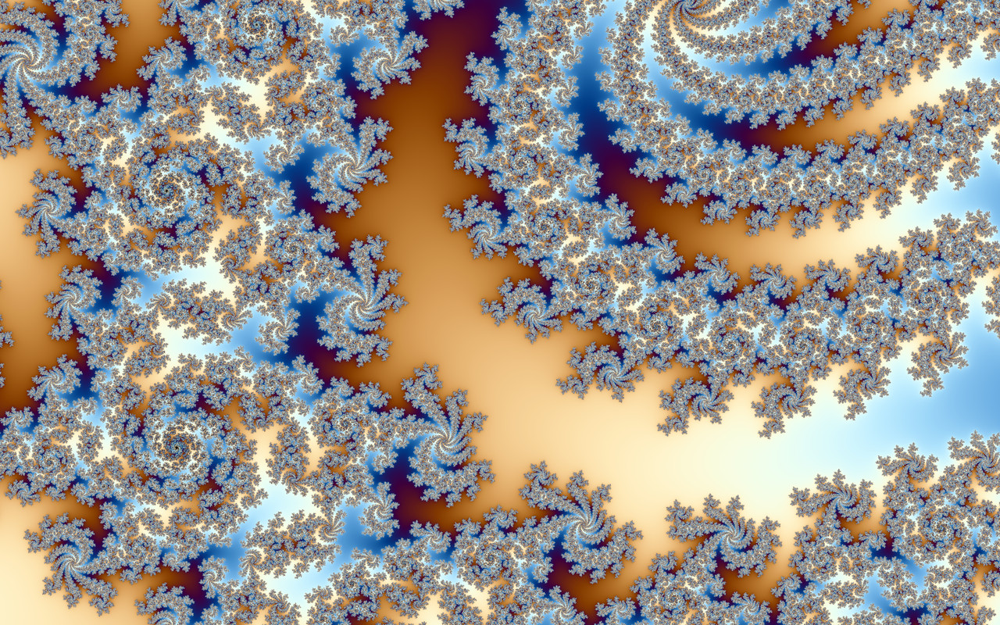
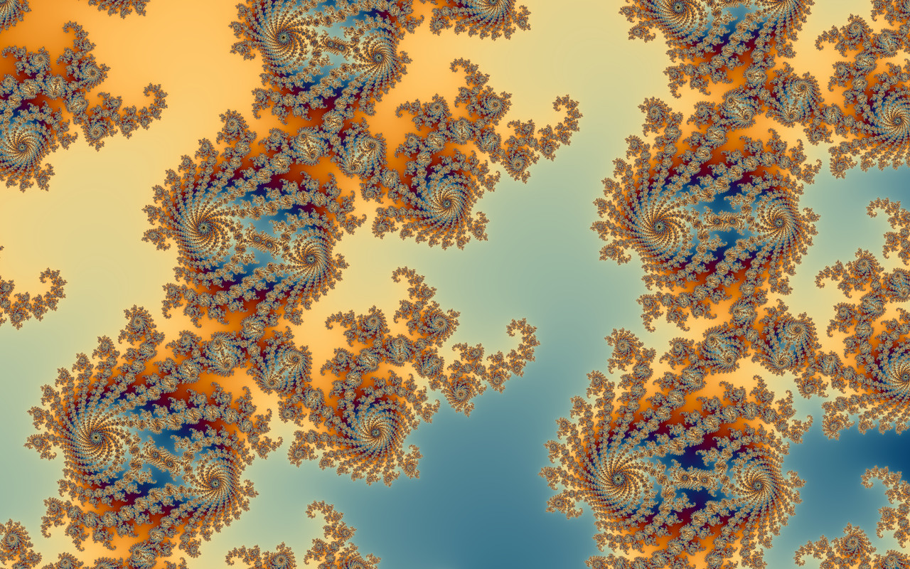
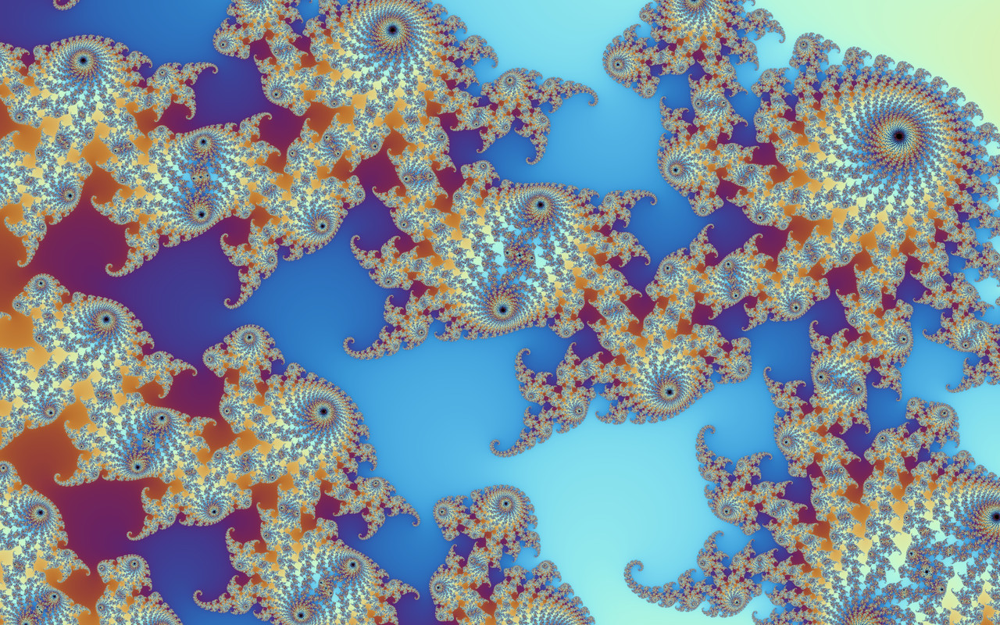
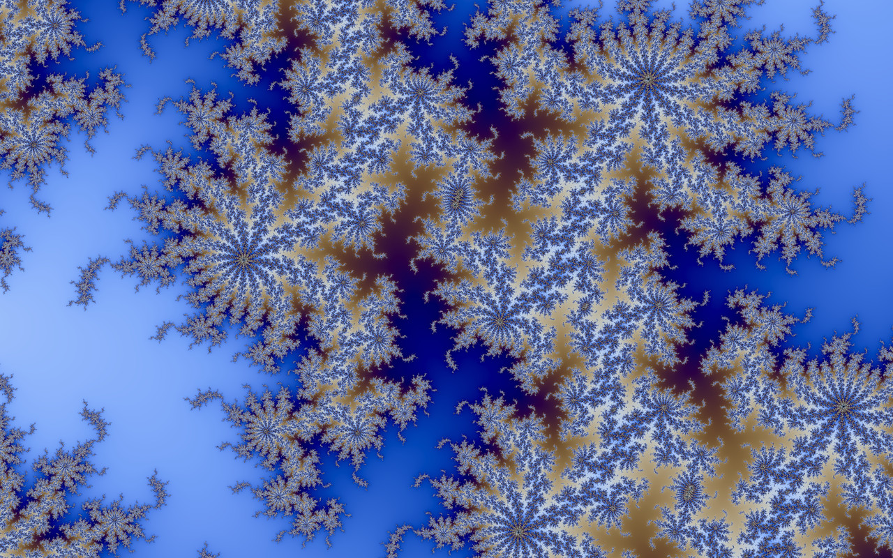
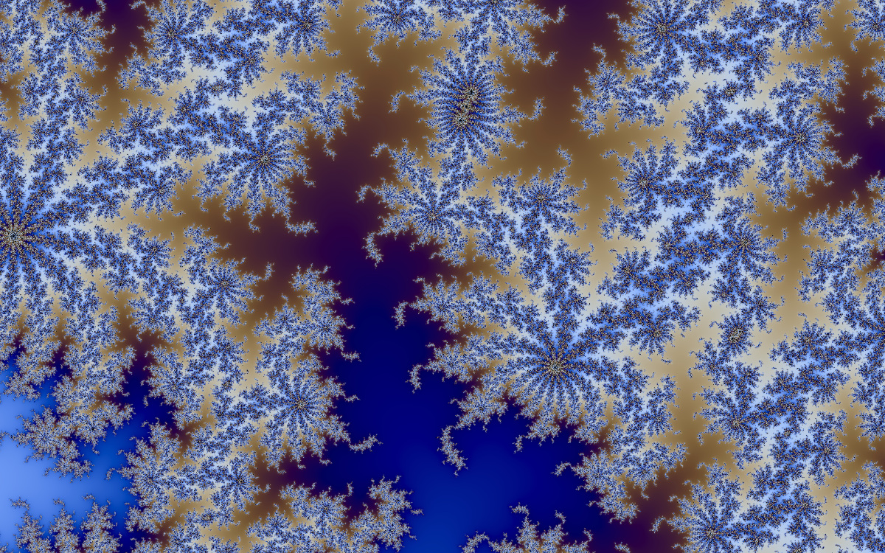

# Fractal Zoom

A C# / SkiaSharp app that flies into the Mandelbrot set continuously and never stops.

[](docs/electric.jpg)

<sub>Super crisp mode, 2× supersampled, at 5.6e5× magnification. [More below.](#screenshots)</sub>

```bash
dotnet run -c Release
```

It opens on a settings screen over a live preview of the first view — pick how it renders, press
enter to start. `esc` brings the menu back at any time, and it has an Exit row.

Keys: `esc`/`tab` settings · `P` [save a still](#saving-a-still) · `E` [explore](#exploring-by-hand) ·
`F` [choose a fractal](#the-other-fractals) · `space` pause · `R` new descent / reset view ·
`↑`/`↓` zoom speed · `G` cycle where the kernel runs · `H` toggle readout · `Q` quit

Both menus are also fully clickable — hover a row to focus it, click the `‹` `›` arrows or the row
itself to change it, and the wheel steps whatever the pointer is over.

## Exploring by hand

`E`, or the Camera row in the menu, or `--explore` on the command line, takes the camera off the
director and gives it to you — starting on the whole set, the view the automatic descent deliberately
skips past:

```bash
dotnet run -c Release -- --explore
```

**Scroll to zoom at the pointer, drag to pan.** The point under the cursor stays under the cursor,
which is what makes a wheel zoom feel like pulling yourself toward something rather than magnifying
the middle of the window; `R` returns to the whole set. Everything underneath carries on unchanged —
the perturbed kernel takes over below 1e-11 as usual, so you can steer past double precision, and the
re-projection covers the gap between what you asked for and what the kernel has finished.

Three things it does not do, because the automatic descent's machinery has nothing to say here: no
rendering ahead of the camera (there is no future position to aim at), no zoom throttle (there is no
rate to hold steady), and no giving up on a view. Zooming stops where the fractal itself stops
resolving — `1e-290` for the Mandelbrot and its Julia sets, about `1e-25` for everything else in the
plane — and has a ceiling a little wider than the whole set.

Every run prints where it ended up, in the form that takes it back there:

```
View: --fractal "Apollonian Gasket" --center -0.488635377933324982648723068,0.2360260227889846086797936 --zoom 1.000e+22
```

Those digits are the point. A view at 1e22× is narrower than the last bit of a double, so a centre
rounded to one lands thousands of screens away from what was meant; `--center` is read to 28 digits for
that reason. Which is also a trap: `(decimal)someDouble` in .NET rounds to *fifteen* significant
digits, so the first version of this printed a number that looked precise, was not, and named nothing
but blank screens.

```
--size WxH        window size (default 1280x800)
--speed N         zoom e-folds per second (default 0.25), held steady
--seed N          RNG seed, which decides the route it takes
--quality N       kernel resolution vs the window, 0.2-2.0 (default 1); above 1 supersamples
--explore         start on the whole set and steer with the mouse
--center X,Y      start at a point in the plane, read to 28 digits
--zoom N          start at N times magnification
--fractal NAME    mandelbrot (default), julia, burning, tricorn, multibrot and twenty more
--still-size N    longest edge of a saved still, in pixels (default 3840; 0 matches the window)
--still-format F  png (default) or jpeg
--renderer WHICH  where the kernel runs: auto (default), gpu or cpu
--freeze N        stop the camera at N magnification and keep re-rendering that one view,
                  so two kernels can be timed on identical work
--no-menu         skip the startup settings screen
--duration N      exit after N seconds (default: run forever)
--no-hud          hide the readout, for clean stills
--palette N       fix the gradient: 0 Electric, 1 Ember, 2 Aurora, 3 Abyss, 4 Copper
--snapshot FILE   write the last frame to FILE as a PNG on exit
```

## Saving a still

`P` opens a dialog: resolution from the window's own size up to **16K**, 4 / 9 / 16 samples per
pixel, the iteration budget at 1× / 2× / 4× the live view's, and PNG or JPEG. It tells you the exact
pixel dimensions, the sample count, and the folder it will write to before you commit, and once one
still has been rendered it estimates how long the next will take from the throughput it measured.

**It is not a screen capture.** The view is computed again from scratch at the chosen size, so a
still is routinely several times sharper than anything that was ever on screen — a 4K still at 9
samples from a 1000×700 window is nine times the pixels, 2¼ times the samples per pixel and twice the
iterations of the best the live view can manage. Files land in your pictures folder as
`fractal-zoom-<timestamp>-<magnification>.png`, and existing files are never overwritten.

[StillRenderer.cs](StillRenderer.cs) runs it on the CPU kernel, on its own thread. The card is much
faster but it is busy keeping the display at vsync, and a still is a one-off that nobody is timing —
so this way the zoom never stalls, the camera stays yours while it works, and the picture comes out of
the reference implementation of the two kernels, the one with the approximation table.

It renders in horizontal bands, which is what makes progress reportable and keeps the supersampled
scratch buffer at about 14 MB where a whole 4K frame at 2× would want 224 MB. Each band is computed
with one extra row above and below that is then discarded, because the colouring reads its
neighbours: without that overlap every band boundary would be coloured as though it were the edge of
the image. Verified by measuring the row-to-row difference across the boundaries — at rows 128, 256
and 384 of a banded still it came out at 39.1, 48.7 and 44.6, inside the 37–54 spread of their
neighbours, so the seams are not there.

## The other fractals

`F`, or clicking the Fractal row in the menu, opens the list — all twenty-six at once in two columns,
each tagged with the renderer it uses, and the current one marked. A row that cycles through
twenty-six values one click at a time is no way to choose from twenty-six things: you cannot see
what is on offer, and reaching the far end takes twenty-five clicks. The arrows on the row still step
through them one at a time if that is what you want.

They are not one kind of thing, so there are three renderers, chosen per fractal by
[Fractals.cs](Fractals.cs):

**Fields** — a number per pixel, straight into the existing two-pass kernel and its band-limited
colouring, on either backend. Mandelbrot (`z² + c`), Julia, Burning Ship (`(|Re z| + i|Im z|)² + c`),
Tricorn/Mandelbar (`conj(z)² + c`), Multibrot (`z³ + c`), Phoenix (`z² + p₁ + p₂·z_prev`), Newton and
Nova (which *converge*, so what is coloured is how long they took and which root they found),
Magnet (`((z² + c − 1)/(2z + c − 2))²`, which both escapes and converges to one), Lyapunov (an
exponent of the logistic map rather than an escape time at all), Pickover Stalks and Orbit Trap (the
same dynamics, recording the orbit's closest approach to the axes or a circle instead of its escape),
and the Sierpiński Triangle and Carpet as per-pixel digit tests — which, unlike drawing them, keeps
working as far down as the arithmetic does.

**Drawn** — [DrawnFractals.cs](DrawnFractals.cs), geometry through Skia, no kernel at all: Koch
Snowflake, Dragon Curve, Barnsley Fern, Apollonian Gasket, Fractal Tree, and an L-system (Hilbert).
Three things make them zoom like the rest rather than to a fixed depth.

Every rule stops subdividing where a piece falls under a pixel, so detail appears as you go in and the
work stays bounded. Coordinates are [Dd](Dd.cs) rather than doubles, which is what carries a
construction past ~1e13×: a construction is built by adding a shrinking offset to a coordinate of order
one, and once the offset falls below that coordinate's last bit a double simply loses it and every
piece of the rule lands in the same place. Verified to **1e22×** on Koch, the dragon, the tree and the
gasket. And the rules are walked a level at a time rather than depth first, which is what makes a frame
that runs out of budget come out evenly detailed instead of lopsided — spending a shared budget depth
first drew the tree's right-hand side in full and left the left-hand side empty.

Four measurements from that path worth recording. The tree ran at **11.3 fps at its opening view**,
before any zooming: not the recursion, but sixteen thousand individual `DrawLine` calls a frame, each
preceded by a colour and width change so Skia could batch none of them. Collecting segments into one
path per recursion depth — about twenty draw calls instead of sixteen thousand — took it to
**99.6 fps**. The depth cap, meant only as a safety valve at 42, was a zoom limit too: the tree shrinks
by 0.72 a level and the dragon by 0.71, so 42 levels only reached about a millionth of the whole. The
fern took **548 ms a frame** once it was walked as boxes rather than thrown as points — almost all of
it Skia smoothing a hundred and sixty thousand individual points, which buys nothing on a cloud whose
points sit a pixel apart; without it, **7 ms**. And the gasket's culling bounded each subtree by the
circle *inscribed* in its gap, which is wrong in a way that only shows up deep: the circles that pile
up towards a tangency point march away from the inscribed one, so past a few levels every subtree
containing them was rejected as off screen and the gasket stopped drawing. It is now bounded by the gap
itself — the box of its three tangency points, grown by each arc's sagitta.

The Apollonian gasket generates each circle by the Descartes reflection `2(a+b+c) − d` on curvature and
curvature×centre, which is exact — an earlier attempt solved the quadratic instead and picked the wrong
root half the time. Checked against the definition rather than by eye: the packing stays mutually
tangent to **2.3e-14** relative (a floor inherited from the starting quadruple, and scale-invariant, so
invisible at any zoom) down to circles of radius 1e-23, degrading past that exactly as `Dd`'s 1e-32
absolute precision predicts.

The fern is the odd one out, in three ways.

It is drawn by **throwing points** — pick a map by its weight, apply it, plot where you land — which is
how a fern is normally drawn and much the cheapest thing here: one multiply-add a point, no recursion,
and the density comes out as the shading. Nothing else looks as much like a fern. What it cannot do is
zoom, since a random point lands in a window a billionth of the fern across about a billionth of the
time, and it fails in a way that measures itself: it simply stops producing any. So the count decides,
and past that the fern is walked as **nested boxes** instead, at a couple of pixels' detail, each point
drawn the size of the box it stands for so the cover reads evenly however the branches divided.

That walk had a bug worth recording, because it is easy to write and looks almost right. It descended by
applying each new map on the *outside*, which is the order the iteration itself runs in — but
`m(parent)` is not inside `parent`, so a node does not contain its own descendants and culling it throws
away pieces that are on screen. A deep view of the fern's tip drew a single point: the nested pieces
around the tip all lived in sibling subtrees, every one culled at the first level for being nowhere near
it. What descends now is the composed transform with each new map applied on the *inside*, which is the
only arrangement in which a child's box lies within its parent's.

It is **coloured like a plant** rather than from the shared gradient, and which part is which comes
straight out of the rule: one of the four maps flattens the whole fern onto a vertical segment, and that
segment is the stem, so a point is on a stem if its recent history includes that map. How recently says
which one — applied last it gives the main stem, one map ago the midribs of the three fronds, two ago
their sub-fronds. For the thrown points, three generations of that is brown and the rest is leaf.

Counting generations is wrong for a zoomed view, though, and looked it: the midribs on screen at a
thousand times in are forty generations down, so every one of them came out green — long straight
leaf-coloured lines through the middle of the picture. What decides in the box walk instead is the size
of the piece when the flattening map was applied to it, so a stem is coloured as one if it is long
enough to read as a line at this magnification, whichever generation it belongs to.

Two measurements from the deep path, both worth keeping. **A point wider than a pixel costs eight times
as much**: past that Skia stops filling single pixels and emits a rectangle per point, which at a couple
of hundred thousand points is a whole frame — 88 ms against 11 ms for the same view. Drawing each point
the size of the box it stood for covered the fern more evenly, and that is what it cost; evenness is
bought by making the *boxes* finer instead, which is affordable because the walk itself is only about
sixteen nanoseconds a node. And **the detail carries over between frames** rather than being searched for
within one, because how much of the window is empty varies enormously with where the camera is while how
full it is of fern does not. A pass that runs into the point budget is never shown: this walk is depth
first, so running out abandons whole regions rather than losing detail evenly, leaving them black behind
a straight edge along whatever box was being subdivided at the time.

And it has nothing to find by going deeper — zoom in and you find another fern, the same fern, forever —
so what varies over time is its **shape**: a slow shear on the one map that carries the stem, applied
over and over and so compounding all the way up, bending every frond a little more than the one below.
How far it may lean before the frond leaves the window is exact rather than a guess, since the tip is
that map's fixed point: solving `(I − M)·p = t` for the sheared `M` says where the tip lands, and setting
that equal to the edge of the view gives the most the fern can lean and stay in frame. In a tall narrow
window that is hardly at all, because the upright fern already nearly fills the width.

**Ray-marched** — a distance estimator per fractal, marched on the card and lit by its own gradient:
Mandelbulb, Mandelbox, Menger Sponge, Sierpiński Tetrahedron, Quaternion Julia, Kleinian. These need
the card, so they override the backend choice rather than quietly rendering something else on the
processor, and the flat view's controls are re-read as an orbit: the pan offsets become yaw and pitch,
and the zoom becomes camera distance, so dragging and scrolling move you around the object. That
distance stops at 0.0008, about 2000× in — the marcher works in fp32 and its hit tolerance scales
with distance, so going deeper would need the marching in doubles or a re-centred camera.

**Two of them reach 1e290×; everything else in the plane reaches about 1e25×.** Perturbation is not
one technique that applies to everything — it is derived per formula, and
[ReferenceOrbit.cs](ReferenceOrbit.cs) carries two:

- **Mandelbrot**, `dz' = 2·Z·dz + dz² + dc`. The reference is the orbit of *zero* under the anchor,
  and the per-pixel offset is a difference in the *parameter*, so it comes back every iteration.
- **Julia**, `dz' = 2·Z·dz + dz²`. Simpler, and different in a way that is easy to miss: the
  reference is the orbit of *the anchor itself* under the set's fixed constant — the anchor is a point
  in the picture rather than the parameter of it — and the per-pixel offset is just where that pixel
  starts, added once and never again. Verified sharp at **1e20×**, where before it was a smooth blur
  past 1e13×. It pays for the depth in speed: with no `dc` term there is nothing for BLA's `B`
  coefficient to multiply, so the table does not apply and every iteration is taken individually.

For everything else, the answer is not a cleverer algorithm but **more digits**, in [Dd.cs](Dd.cs):
a number held as an unevaluated sum of two doubles, which carries about 32 significant digits instead
of 16. Below 1e12× the twelve remaining field formulas switch to iterating in that, which moves them
from ~1e13× to about **1e25×**. It needs no derivation and works for all of them — including the ones
perturbation cannot touch, like the Lyapunov exponent, whose iteration is not analytic in the
parameter at all. What it costs is the card: GPU arithmetic is fp64 and gives out exactly where a
double does, so these views come back to the processor, where a frame takes tens of milliseconds
rather than three. The readout says `fp128` when that has happened.

Measured on 64 neighbouring pixels at a scale of 1e-20, at a slow-escaping point: the double kernel
returns **one** distinct value across all of them, the wide kernel returns 42 for Burning Ship, 64 for
Tricorn, 16 for Multibrot. The convergence-time formulas — Newton, Nova, Magnet — colour by whole
iteration counts, so they have far less to resolve at any scale; the arithmetic no longer stops them,
but a deep view of one is mostly flat unless it straddles a basin boundary.

Perturbation would still be faster and deeper where it applies, and Tricorn, Multibrot and Phoenix are
mechanical from the two forms above. Burning Ship has a known perturbed form that needs the sign taken
from the reference. Those are worth doing; the wide arithmetic is what makes them optional rather than
the only way to see past 1e13×.

The automatic descent needs escape times to steer by, so the drawn and ray-marched ones hand the
camera to you instead.

## Screenshots

All four rendered in **Super crisp** mode (2× supersampled, four samples per pixel), one per colour
gradient, captured with `--no-hud --quality 2 --speed 0.09`:

| Electric | Ember |
| --- | --- |
| [](docs/electric.jpg) | [](docs/ember.jpg) |
| **Aurora** | **Abyss** |
| [](docs/aurora.jpg) | [](docs/abyss.jpg) |

A centre crop at **1:1, no resampling** — actual output pixels, so the supersampling is visible rather
than implied. Filaments hold their shape down to single pixels instead of breaking into speckle:

[](docs/detail-1to1.jpg)

Reproduce any of them:

```bash
dotnet run -c Release -- --no-menu --no-hud --quality 2 --speed 0.09 \
    --seed 31 --palette 3 --duration 90 --snapshot abyss.png
```

## Startup settings

[SettingsScreen.cs](SettingsScreen.cs) draws the menu over the actual opening view, with the zoom
held still (a zero throttle freezes both scale and pan) and every setting applied on the frame it
changes — so the choices can be seen rather than guessed at.

| Setting | What it trades |
| --- | --- |
| Fractal | Which [formula](#the-other-fractals) the kernels iterate. |
| Camera | Descends by itself, or [hands you the mouse](#exploring-by-hand) starting from the whole set. |
| Detail | Kernel pixels against the window. *Super crisp* and *Sharper* supersample; lower settings are softer but each descent reaches much deeper. |
| Zoom speed | Held constant while a descent lasts, so slower also means it gets further down. |
| Motion sharpness | How much a frame may be stretched while the next computes. |
| Kernel runs on | The graphics card, the processor, or whichever is measured faster at the current depth. |
| Colours | A fixed gradient, or a new one per descent. |
| Readout | The figures in the corner. |

**Super crisp** renders above the window resolution (2× linear, so four samples per pixel) and
averages the extra samples back down — Skia with mipmaps on the CPU path, a
[resolve pass](#the-gpu-kernel) on the card. Plain bilinear only reads a 2×2 neighbourhood and would
alias most of the extra samples away. It resolves structure finer than a pixel instead of letting the band-limited
colouring average it into a smooth wash. Measured on an identical frozen view, the Laplacian standard
deviation of a detailed patch rises from 56.4 to 62.6, and filaments visibly hold their shape instead
of breaking into speckle. Kernel buffers land in the 20-24M pixel range for a 1280×800 window on a retina
display (~730 MB peak RSS against 358 MB at Native), and a 24M-pixel ceiling keeps a larger display
from asking for gigabytes — supersampling squares with the factor, so an uncapped 2× on a 5K panel
would want well over 100M pixels per buffer.

Because supersampling multiplies kernel cost by the square of the factor, and the zoom rate is held
steady, selecting it **pulls the speed row down with it** — at the normal rate a super-crisp descent
becomes unsustainable within seconds and ends almost immediately. That happens visibly in the menu
rather than as a hidden factor, so it stays overridable. Paired: `--quality 2 --speed 0.1` sustained a
single descent to 1.3e7× over 100 s, where `--quality 2 --speed 0.25` burned through 7 descents in 75 s.

Below the settings are three action rows — *Start* / *Resume*, *Start a new descent* and *Exit* —
so the menu is also the way out. `esc` toggles: into the menu from the zoom, and back out of it.

The panel has a second page, for [stills](#saving-a-still), which `P` opens. Two pages rather than
two panels: the navigation, the drawing and the look are identical, only the rows and the action at
the bottom differ. Everything on both pages works by mouse as well as by key — the row rectangles are
recorded on each draw and hit-tested against what is actually on screen, rather than against a second
copy of the layout arithmetic that could drift out of step with it.

Values passed on the command line preselect the matching entries, so the two cannot disagree, and
reopening the menu syncs its Readout row to whatever `H` last left it at. `--no-menu` skips the screen
entirely, which is what the timed and snapshot runs use.

The state machine is covered by 34 assertions (navigation wrapping, left/right being inert on action
rows, each action's return value, preselection) — worth having, since keystrokes cannot be driven
through GLFW headlessly.

## Running from an IDE

The same four argument combinations — *Deep dive*, *Max sharpness*, *Snapshot after 30s*,
*Small window* — are set up for all three, so the useful runs are one click away wherever you open it.

**Visual Studio** — open `FractalZoom.slnx`. The Run dropdown is populated from
`Properties/launchSettings.json`. The same profiles work from the CLI:

```bash
dotnet run -c Release --launch-profile "Deep dive"
```

The solution is in the [XML `.slnx` format](https://devblogs.microsoft.com/visualstudio/new-simpler-solution-file-format/),
which Visual Studio 2026, Visual Studio 2022 from 17.14, Rider from 2025.1 and the `dotnet` CLI from
9.0.200 all open directly. It replaces the old `FractalZoom.sln` rather than sitting beside it,
because with both present the SDK cannot tell which one a bare `dotnet build` means and stops with
MSB1011. Anything older than that can regenerate a classic solution in one command:

```bash
dotnet new sln -n FractalZoom && dotnet sln FractalZoom.sln add FractalZoom.csproj
```

**JetBrains Rider** — open the same `FractalZoom.slnx`. The run configurations in
[.run/](.run/) are checked in, so they appear in the dropdown on first open with no per-machine
setup; each tracks the project's output path, so switching the solution configuration between Debug
and Release switches which build it launches. Rider also lists the `launchSettings.json` profiles
alongside them, which is the same set by another route.

**VS Code** — F5. `.vscode/launch.json` has matching configurations and builds Release first, which
matters: this is a compute-bound renderer, so the configuration you launch changes how deep it gets.
There is also a *Debug build* configuration for breakpoints, in a smaller window since it is slower.

Note that `Optimize` is enabled for **both** configurations in the csproj, deliberately — an
unoptimised build of the escape-time kernel is slow enough to look broken rather than merely slower.
The trade is that stepping through the kernel sees some inlining.

## Platforms

Runs on macOS, Windows and Linux — Silk.NET/GLFW for the window and OpenGL for the surface, all of
which are portable. The window asks for a 4.0 context, which is what the
[GPU kernel](#the-gpu-kernel) needs for double precision in shaders, and drops back to 3.3 with the
CPU kernel if the driver will not give it one. Native assets for all three platforms ship in the
build, so `dotnet run` is enough:

```bash
dotnet publish -c Release -r linux-x64  --self-contained false
dotnet publish -c Release -r win-x64    --self-contained false
dotnet publish -c Release -r osx-arm64  --self-contained false
```

Two portability details that are easy to get wrong: the base `SkiaSharp` package carries no native
library at all, so `SkiaSharp.NativeAssets.Linux`, `.Win32` and `.macOS` are all referenced
explicitly (without the Linux one it builds fine and then fails at startup); and the HUD font is
resolved from a candidate list per platform, because `SKTypeface.FromFamilyName` substitutes a
default instead of returning null for a missing family, so the name has to be checked on the result.

## How deep it goes

The zoom rate is held steady, so depth is bounded by what the machine can render at that rate rather
than by precision — a descent ends and a new one begins when it can no longer keep up. Measured on an
M4 Max (16 cores), 1280×800 window on a retina display:

| settings | descent length | reached |
| --- | --- | --- |
| defaults — native detail, steady speed | 144 s | 1.5e16× |
| " (second descent, same run) | ~150 s | 1.9e19× |

Those are CPU-kernel figures. With the [GPU kernel](#the-gpu-kernel) the same class of machine holds
a 1e17× view at 69 ms a frame, which leaves the throttle pinned at its ceiling with roughly fourteen
times the headroom before the give-up threshold — so what bounds a descent moves from the kernel back
toward the iteration cap and the 1e290 precision floor. A 200 s run at `--speed 1.5` passed 3.16e26×.

Lower the detail or the speed and descents go considerably further, because depth compounds: a
cheaper kernel sustains the rate longer, and the deeper it gets the more iterations the bilinear
approximation can skip, which makes the kernel cheaper again. For reference, under the older
*variable*-rate design (which slowed to a crawl instead of ending) the same machine reached 4.5e85× in
two minutes at `--quality 0.4 --speed 2.5` — depth was available, it just did not look or feel good
getting there.

## How it works

**Window and canvas** — [Program.cs](Program.cs) opens a GLFW/OpenGL window via Silk.NET and binds
a SkiaSharp GPU surface (`GRContext.CreateGl`) to framebuffer 0. Everything drawn — the fractal, the
fade, the HUD — goes through one `SKCanvas`.

**Where to fly** — [ZoomDirector.cs](ZoomDirector.cs) shrinks the view scale exponentially, so zoom
is linear in log space and reads as constant speed. It re-aims on every 1.25× of magnification, which
is cheap — a few hundred escape-time samples against the kernel's billions of iterations — and both
tracks the boundary closely and notices a view going featureless within a second. Re-anchoring the
reference orbit is much rarer, once per doubling, since that means rebuilding a high-precision orbit
and its approximation table.

A descent also **fast-forwards through its first five levels instantly**. The wide view of the whole
set is mostly smooth exterior — a potential field with detail only along the boundary — and it reads
as blurry no matter how many pixels it is rendered at, because there genuinely is no fine structure
out there. Skipping to ~1000× means the first visible frame already sits among filaments.

**Staying on the boundary** — a point exactly on the set boundary can be zoomed into forever without
running out of detail, so the closer the target is to it, the less the camera has to steer. This
matters more than it sounds: with the target chosen as the slowest-escaping sample of a coarse grid,
its distance from the boundary is only as good as the grid spacing, and after zooming 4× that error
is four times larger relative to the view. Repeat it and the camera drifts off into featureless
exterior and spends minutes magnifying empty space. Simulating 40 descents, **every single one died
that way**, some as shallow as 4e14×.

Three changes fixed it, in order of importance:

- **Hill-climb the target onto the boundary.** Escape time grows without limit as the boundary is
  approached, so a pattern search on it with a shrinking radius converges to a point just outside —
  interior samples are rejected, which parks the target where there is both structure and colour.
- **Re-pin the existing course rather than picking a new target.** Choosing afresh on every re-aim is
  actively harmful: the camera never converges on anything, it just chases. The normal path refines
  from where the camera is already heading.
- **Give up gracefully when a region really is exhausted.** If the search finds no exterior at all,
  or its best target cannot climb to a quarter of the iteration budget, the descent cross-fades to a
  new one instead of grinding onward.

Simulated over 40 descents, that is 0 deaths below 1e60× magnification, with several reaching the
1e290 precision floor.

**The kernel** — [Mandelbrot.cs](Mandelbrot.cs) is an escape-time renderer run with `Parallel.For`
across all but one core, in two passes: an escape-time field, then colouring. Interior points are
cheap — the main cardioid and period-2 bulb are rejected algebraically, and everything else gets
periodicity detection so a cycling orbit stops early.

**Depth** — see [the next section](#going-deeper-than-double-precision). Above 1e13× magnification
the kernel switches to perturbation against a high-precision reference orbit.

**Why it isn't pixelated** — three things, all worth knowing about:

0. *The image handed to Skia outlives the flush.* `SKImage.FromPixels` neither copies the kernel
   buffer nor takes ownership of it, and Skia's GPU backend may not have read those pixels by the time
   the draw call returns. Releasing the image before flushing therefore lets it read memory the kernel
   buffer has since freed or reallocated — which surfaced as an intermittent hard crash with no
   managed stack trace and no output at all. The kernel thread also reports exceptions now, since one
   dying there used to be indistinguishable from a clean exit.

1. *The kernel runs off the display thread.* [FractalRenderer.cs](FractalRenderer.cs) renders on a
   worker while the window animates at vsync. Each display frame takes the newest finished frame and
   re-projects it onto the current camera with a Skia translate+scale derived from the two views'
   complex-plane coordinates, so every point stays geometrically aligned. The kernel is therefore
   free to take a second or more without the animation stuttering.

2. *It renders ahead of the camera, with overscan.* The worker is given the camera position the view
   will have once the kernel finishes, so the finished frame lands at ~1:1 instead of always needing
   to be magnified. A frame only covers the window if its view is at least as wide as the view at the
   moment it lands, which takes three things: the lead deliberately undershoots the latency estimate,
   the target offset is hard-capped at 40% of the view (`MaxTargetOffset`), and the kernel buffer
   covers extra field of view at matching pixel density. That overscan **scales with the drift
   budget** rather than being fixed — a flat 6% left visible gaps of ~160px at the highest zoom
   speed, because the faster the zoom the further the camera travels during a frame's life and the
   more a jittery latency estimate can miss by. Audited at 0 gaps in ~16,000 frames across three
   speeds.

3. *The palette is band-limited.* Colouring runs over the escape-time field rather than inline. For
   each pixel it estimates how many colour cycles that pixel spans from the local gradient of the
   field, and attenuates the palette's oscillating component toward its mean by `1/(1+3·dv²)`. Where
   structure is finer than a pixel the colour converges to the average instead of sampling the ramp
   at random — the same idea as analytic antialiasing in a shader. It is what turns deep filaments
   from salt-and-pepper noise into smooth structure, and it costs one extra pass rather than the 4×
   of supersampling.

## Going deeper than double precision

A `double` carries ~16 significant digits, so plain escape-time iteration stops resolving
neighbouring pixels at roughly **1e13×** magnification — about 75 seconds into a descent. The fix is
**perturbation**, in [ReferenceOrbit.cs](ReferenceOrbit.cs) and [BigFixed.cs](BigFixed.cs).

Instead of iterating each pixel's `c` in high precision, one high-precision *reference orbit* `Z` is
computed for a nearby anchor point. With `dz = z - Z` and `dc = c - C`, the iteration becomes

```
dz' = 2·Z·dz + dz² + dc
```

`dc` and `dz` stay tiny, so their *relative* double precision still separates pixels 1e-60 apart —
which is the whole point. Only the one orbit needs big arithmetic, a few thousand iterations per
rebuild rather than per pixel, so this is barely slower per pixel than the plain kernel. Details
that matter:

- **Rebasing.** Whenever the orbit passes nearer the origin than the delta itself (`|z| < |dz|`),
  `dz` is reset to `z` and the reference index to 0. Since `Z[0]` is exactly 0 this is lossless, and
  it restores precision exactly where cancellation would otherwise destroy it. This is what removes
  the "glitches" that perturbation renderers are known for, without needing a second orbit.
- **The anchor is chosen to be interior when possible.** The director already knows which of its
  grid samples never escaped; anchoring there keeps the orbit bounded for the whole iteration
  budget, so pixels never have to rebase off the end of it.
- **Orbit values are stored as `double`.** Their rounding error is common to every pixel in the
  view, so it acts as a negligible shift of the whole image rather than as per-pixel noise. Only the
  anchor coordinate needs the big fixed-point type.

This moves the wall from 1e13× to about **1e290×**, where the pixel deltas themselves stop being
representable as doubles. Verified against ground truth computed entirely in 400-bit fixed point:

| view scale | perturbed | plain fp64 |
| --- | --- | --- |
| 1e-16 | 100% | 36% |
| 1e-25 | 100% | 0% |
| 1e-40 | 100% | 0% |
| 1e-140 | 100% | 0% |

(300 samples each around a boundary point located to 1e-47, agreement meaning the smooth escape time
matches to within 0.01.)

### Skipping iterations: BLA

Perturbation makes depth *possible*; [BlaTable.cs](BlaTable.cs) makes it *fast*. While a pixel's
delta is small the `dz²` term is negligible and the step is effectively linear, `dz' = A·dz + B·dc`.
Linear maps compose, so a run of consecutive steps collapses into one `(A, B)` pair. The table holds
those pairs for runs of 2, 4, 8, … steps, each with the radius of `|dz|` inside which it stays
accurate, and a pixel takes the longest jump its delta currently allows.

Measured against the step-by-step path at the same coordinates:

| view scale | speedup | agreement |
| --- | --- | --- |
| 1e-20 | 1.6× | 99.93% (worst error 0.2 iterations) |
| 1e-40 | 3.0× | 100% |
| 1e-80 | 458× | 100% |

The gain grows with depth because a run's length is limited by how far below `Epsilon·|Z|` the delta
is, and deep views have dozens of decades of headroom. Two things are worth knowing:

- **The error tolerance is set by measurement, not theory.** The per-skip error compounds along a
  run, so loose values are visibly wrong — at `1e-6` the escape times disagreed for 12% of pixels.
  `1e-16` was the largest value with no interior/exterior flips at any depth tested, and flips are
  the visible failure mode (isolated black specks). Speed was traded for that.
- **The table is only built when it can actually be used.** A skip needs `|dc|` below `Epsilon·|Z|`,
  so above ~1e16× magnification there is nothing to gain and the table is skipped entirely; below
  that it would be built, consulted, and never hit — measurably slower than plain iteration.

### What gives instead: the descent ends

Perturbation removes the precision wall and BLA removes most of the cost wall, but not all of it: the
iteration count needed still climbs with depth — a few hundred near the top, ~3300 at 1e19×. So
something has to give. Three candidates, and the choice matters:

- *Resolution* — rejected. Sacrificing it is what made deep views look pixelated.
- *Iteration count* — rejected, and measured rather than assumed: at 1e-20 every escaping pixel
  sampled took more than 0.75× the budget, so trimming it would turn escaping pixels into wrongly
  black ones rather than save work.
- *The zoom rate* — the earlier design, but letting it fall without limit makes the descent visibly
  grind to a halt.

So the rate is held **near-constant** — free to vary only between 60% and 100% of what was asked, which
reads as steady — and when even that floor cannot hold the drift budget, the descent **cross-fades to a
fresh one** rather than crawling. Depth per descent is therefore bounded by what the machine can
render at a steady rate, not by precision.

Measured at the defaults (native detail, steady speed): a descent ran **144 s to 1.5e16×**, and the
next reached 1.89e19× — sharp throughout, at the full framebuffer resolution, with the throttle
staying inside 0.60–1.00. Lower the detail or the speed and descents go considerably further.

One subtlety worth recording: the give-up test only applies in the steady state. A new descent starts
while the latency estimate still holds the previous one's deep, slow value, and counting that ended
fresh descents 1.8 s after they began.

### The GPU kernel

Skia's own work — the blit, the resampling, the fade, the HUD text — has always run on the graphics
card through the OpenGL backend. [GpuKernel.cs](GpuKernel.cs) puts the Mandelbrot kernel there too:
GLSL 4.0 fragment shaders for the escape-time field and the colouring (and a third pass when
supersampling, below), run over an FBO whose texture is handed straight to Skia with
`SKImage.FromTexture`. Nothing is copied — the frame is drawn where it was computed — and it goes
through the same re-projection as a CPU frame, so everything downstream is unchanged.

The shaders are a transcription of [Mandelbrot.cs](Mandelbrot.cs) and
[ReferenceOrbit.cs](ReferenceOrbit.cs) in the same order of operations, including rebasing, so the
two backends agree about where the set's edge is. Three parts are not transcriptions:

- **The iteration is fp64, not fp32.** This is the constraint the earlier design notes ran into, and
  it has not gone away: perturbation lowers the precision needed for the *centre*, not for the
  per-pixel deltas, which sit around 1e-60 and are not representable in fp32 at all — its exponent
  range gives out long before its mantissa does. It buys correctness at every depth the CPU path
  reaches, and it is expensive: compiling the shallow kernel both ways and timing them on the same
  frozen view, **fp32 ran 17.5× faster than fp64** (0.55 ms against 9.64 ms a frame). That number is
  the size of the prize still on the table, and the way to collect it is *rescaled* perturbation,
  carrying an explicit power-of-two scale factor per pixel so the deltas stay inside fp32's exponent
  range. The bookkeeping — realigning three terms of wildly different magnitude every iteration, and
  an orbit stored with its own exponents so a near-zero pass does not flush to nothing — would eat
  much of the 17.5×, and getting it wrong shows up as the speckle this renderer exists to avoid. Not
  implemented.
- **The reference orbit is uploaded as raw doubles**, two 32-bit halves per component in an
  `RGBA32UI` texture buffer, reassembled with `packDouble2x32`. Rounding it to fp32 would be far
  cheaper and completely wrong: the orbit is the one thing every pixel shares, so an error in it is
  an error in every pixel at once.
- **No BLA.** The approximation table's variable-length skips are what the CPU has going for it at
  depth; on a card, neighbouring pixels taking different-length jumps costs more divergence than the
  skips save. This is why the margin below narrows as the view gets deeper.

**Frames are rendered in horizontal strips spread across display frames.** The whole design here
rests on the display staying at vsync while the kernel runs behind it, and a single draw call that
takes half a second would freeze the window for half a second — and, past a couple of seconds, be
killed outright by the Windows display watchdog. Each strip is sized from a running measurement of
cost per pixel-iteration (GL timer queries, polled, never waited on) to fill about 70% of a display
frame. A fraction rather than a fixed number of milliseconds, because it has to hold at any refresh
rate: 8 ms is two thirds of a 60 Hz frame and more than a whole 165 Hz one.

**A strip has a floor on how small it may be, and that turned out to matter more than anything else
in the kernel.** A strip is a rectangle of pixels, and the card wants thousands of threads in flight
to hide the latency of a dependent fp64 chain; a thin one leaves most of it idle, so the work does
not get cheaper anywhere near in proportion to its size. Timed on one frozen view at 1e17×, cost per
whole frame against strip height:

| strip | 224 rows | 168 | 112 | 64 | 32 | 16 |
| --- | --- | --- | --- | --- | --- | --- |
| card time per frame | 65.4 ms | 66.0 ms | 78.1 ms | 149.0 ms | 224.2 ms | 321.6 ms |

Worse, it compounds. The cost model measures the collapse, concludes the strips must be smaller
still to fit inside the budget, and drives itself into the corner — which is where it had settled.
A floor of 128,000 pixels took that view from **296.9 ms to 69.2 ms of card time, a 4.3× speedup for
three lines**. The floor sits at the low end of the flat part of that curve rather than the middle:
192,000 measured the same to within a millisecond, and the smaller value leaves the pacing more room
to hold the display at vsync when frames are expensive — measured at 59 fps at 1e17×, against 57 with
the larger floor.

A frame that only just overruns the budget is finished rather than split, for the same family of
reason: a split costs a whole display frame of latency, and overshooting one vsync interval by a
third beats handing the display a frame twice as stale. Without that, a cheap frame could take
*longer* to arrive from the card than from the CPU — the CPU worker runs flat out on its own thread,
where the card is deliberately paced.

**The two magnitude tests in the inner loop do not square anything.** Escape and rebasing both ask
about a magnitude, and taking the larger component instead of the true length removes four of the
eleven fp64 multiplies in the loop — worth **1.13×** (77.5 ms against 68.7 ms on that same view).
Neither test needs the precision: the escape threshold is arbitrary and the smooth count is computed
from the real magnitude once, at escape, while rebasing is exact wherever it happens, so triggering
it a fraction of an iteration early or late changes nothing. Checked rather than assumed — against
the CPU kernel on an identical frozen view, the cheap tests disagree with it on 0.30% of pixels by
more than 16/255, and the squared tests they replaced disagree on 0.31%. Equally close to the
reference, one of them 13% faster.

**Supersampled frames are resolved on the card**, by a third pass that box-filters the extra samples
down to screen density before the frame is handed over. This is not an optimisation, it is a
workaround that turned out to be the better design. Skia can minify while drawing, but only well
with mipmaps, and its mipmapped sampling of a texture it does not own renders the frame as a flat
wash of the image's mean colour — with the mip chain generated, complete, and verified level by
level (`level 1` 1000px, `level 4` 125px, no GL error). Resolving first means Skia only ever draws a
card frame at about 1:1, and a box over exactly the samples belonging to an output pixel is a better
filter than a blend of the two power-of-two levels straddling it.

Two traps worth recording, both of which produce a *plausible* wrong answer rather than an error:

- Drawing commands return long before the card has run them, so when a whole frame is issued in one
  strip the wall clock reads **zero**. Fed to the zoom controller that reads as a free kernel, and
  the camera races ahead of frames that have not been drawn yet. The card's own timer queries are
  the floor under that measurement.
- Generating mip levels for a texture still attached to the bound framebuffer reads and writes the
  same image. It is undefined, it raises no error, and it was not in fact the cause of the flat
  frames above — but it was there, and it had to be ruled out before the real cause was visible.

Measured on a Radeon RX 9070 XT against a Ryzen 9 5950X (16 cores), kernel buffer 1008×672, timing
the full latency from submission to a usable frame. Depth alone does not pin a view down — the route
is re-aimed against the clock, so two runs stopping at the same magnification stop in different
places, and a frame costs far more or less depending on where it is than on how deep it is. The
`--freeze` flag steps the descent at a fixed rate and then stops the camera, which makes the route a
function of the seed and these a like-for-like comparison of one identical view:

| view | GPU kernel | CPU kernel | |
| --- | --- | --- | --- |
| 1.01e9× | **17.1 ms** | 118.3 ms | 6.9× |
| 1.02e13× | **59.2 ms** | 291.1 ms | 4.9× |
| 1.01e17× | **69.2 ms** | 731.8 ms | 10.6× |

The margin dips in the middle of that range because BLA is switching on for the CPU: a skip needs
`|dc|` below `Epsilon·|Z|`, so the table is not built at all above about 4e16×, and below it the CPU
starts taking whole runs of iterations at a time while the card is still taking them one by one.
Deeper still, that stops keeping up with the sheer width of the card.

Which one wins where is a property of the machine rather than of the program, though — a GeForce
runs fp64 at 1/64 of its fp32 rate where this Radeon runs it at 1/32, and the CPU side varies by
core count. That is not a safe thing to hardcode, which is why the default is `--renderer auto`: it
**measures both and follows the faster one**, handing the idle backend one frame every three seconds
and moving the kernel if the other is at least 20% faster. The margin is what stops it trading
frames back and forth over noise when the two are close. The
probe costs one kernel frame every few seconds (0.35 e-folds of the 49 in a 110 s run) and leaves a
fresh frame behind on the backend it timed, so a handover has something current to draw immediately.
`--renderer gpu` / `cpu` pin it, and `G` cycles the three at any time.

A card that cannot run it is not an error: if the driver will not give a 4.0 context, or the shaders
will not compile, the reason is printed and the run continues on the CPU kernel exactly as before.
That is also the expected outcome on macOS, where the GL implementation is capped and there is no
fp64 in Metal either — the fp32 rescaling work above is what would be needed there.

### The cross-fade

The director still cross-fades to a fresh descent with a new palette if a view ever reaches the
`1e-290` floor, and `R` triggers the same thing on demand — but at realistic throttled speeds that
floor is no longer something you reach by waiting. The `cycle` counter in the HUD tracks it.
