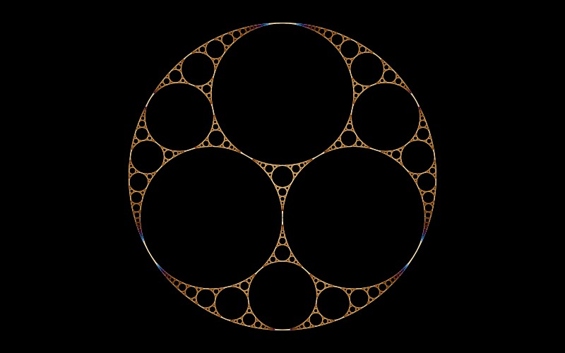

# Apollonian Gasket

[](../gallery/apollonian-gasket.jpg)

Fill the gap between three touching circles with the circle that touches all three. Then do it again in the three gaps that opens.

## The rule

### Bends, and Descartes' theorem

Work with the **bend** of a circle, $k = 1/r$, signed: positive for a circle you are outside of,
negative for one that encloses everything else. For four mutually tangent circles Descartes' theorem
says

$$(k_1 + k_2 + k_3 + k_4)^2 = 2\left(k_1^2 + k_2^2 + k_3^2 + k_4^2\right)$$

Given three of them this is a *quadratic* in the fourth, and a quadratic has two roots — which is
exactly right, because there are exactly two circles tangent to three given ones. Solving:

$$k_4^{\pm} = k_1 + k_2 + k_3 \pm 2\sqrt{k_1k_2 + k_2k_3 + k_3k_1}$$

The square root is the awkward part, and the trick is never to take it. The two roots of a quadratic
sum to minus its linear coefficient over its leading one, so

$$k_4^{+} + k_4^{-} = 2(k_1+k_2+k_3)$$

If you already know one of the pair — and you do, it is the circle you came from — the other is

$$k_4' = 2(k_1+k_2+k_3) - k_4$$

Subtraction, no root, no choosing between branches. That is the step this program iterates, and getting
it wrong by solving the quadratic instead is what produced a wrong circle half the time in an earlier
attempt.

### The same step moves the centres

Descartes' theorem has a complex extension (Lagarias, Mallows and Wilks) covering *where* the circles
are, not just how big. Writing each centre as a complex number $z_i$, the products $k_i z_i$ satisfy the
identical relation:

$$(k_1z_1 + k_2z_2 + k_3z_3 + k_4z_4)^2 = 2\left((k_1z_1)^2 + (k_2z_2)^2 + (k_3z_3)^2 + (k_4z_4)^2\right)$$

So the same reflection $2(a+b+c) - d$ applies unchanged to $kz$ as to $k$. This is why the circles in
this program are carried as the triple $(k,\ kx,\ ky)$ rather than as centre and radius: in those
coordinates generating the next circle is one linear step on three numbers, exact and cheap, and the
centre comes back out as $z = (kz)/k$ whenever it is needed.

### Integers, and the dimension

Because the step is subtraction and addition of the previous bends, an initial quadruple of whole
numbers gives a packing in which **every** bend is a whole number, for infinitely many circles. The
$(-1, 2, 2, 3)$ packing is the classic one. Which bends can occur is a live question in number theory.

The circles fill the disc but leave a residual set of measure zero behind — the points never covered —
whose Hausdorff dimension is about **1.3057**. The curvatures grow roughly geometrically as you descend,
which is why a view a thousand times in is already fifty levels down, and why the recursion cap here has
to be generous rather than tidy.

## Where it came from

The tangency problem is **Apollonius of Perga**'s, from around 200 BC. The theorem is in a letter **René Descartes** wrote to **Princess Elisabeth of Bohemia** in 1643. It was rediscovered in 1936 by **Frederick Soddy** — the chemist who won a Nobel Prize for isotopes — who published it in *Nature* as a poem, "The Kiss Precise":

> For pairs of lips to kiss maybe / Involves no trigonometry. […]
>
> The sum of the squares of all four bends / Is half the square of their sum.

Thorold Gosset extended it to `n` dimensions in the following issue, also in verse.

## Worth knowing

If the first four bends are integers, **every** bend in the gasket is an integer, all the way down for infinitely many circles — a fact that connects the picture to number theory and is still generating research.

## How this program draws it

Each circle is generated by the reflection `2(a+b+c) − d` acting on curvature and curvature×centre, which is exact and needs no square root. An earlier attempt solved the quadratic instead and picked the wrong root half the time.

Two bugs here are worth recording. The subtree culling bounded each gap by the circle *inscribed* in it — but the circles that pile up towards a tangency point march away from that one, without limit relative to its radius, so past a few levels every subtree containing them was rejected as off screen and the gasket stopped drawing partway into a zoom. It is now bounded by the gap itself: the box of its three tangency points, grown by each arc's sagitta. And a circle far wider than the window was being handed to Skia as a radius of a hundred million million pixels, which draws nothing; past rasterisable width its arc across the window is a straight line, so that is what gets drawn.

Checked against the definition rather than by eye: the packing stays mutually tangent to 2.3e-14 relative down to circles of radius 1e-23. Verified at **1e22×**. See [DrawnFractals.cs](../../DrawnFractals.cs).

## See it

```bash
dotnet run -c Release -- --explore --no-menu --fractal apollonian
```

[← All twenty-six](../../README.md#every-fractal)
