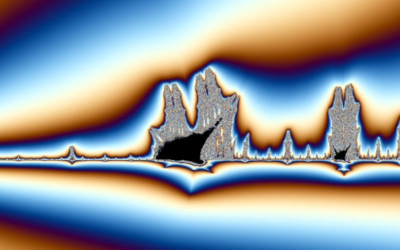

# Burning Ship

[](../gallery/burning-ship.jpg)

The Mandelbrot iteration with absolute values taken before squaring, which breaks its symmetry and produces something that looks like a ship on fire.

## The rule

$$z_{n+1} = \left(|\operatorname{Re} z_n| + i\,|\operatorname{Im} z_n|\right)^2 + c$$

started from $z_0 = 0$, with $c$ the pixel. Written out, with $z = x+iy$:

$$x_{n+1} = x_n^2 - y_n^2 + \operatorname{Re} c, \qquad y_{n+1} = 2\,|x_n y_n| + \operatorname{Im} c$$

The only difference from the Mandelbrot is the absolute value on the cross term, and it changes the
subject entirely.

### Why losing analyticity matters

$z \mapsto z^2$ is complex-differentiable; $z \mapsto |{\operatorname{Re} z}| + i|\operatorname{Im} z|$ is
not, at any point where either part vanishes. The map folds the plane along both axes instead of turning
it smoothly. Almost every tool that built the theory of the Mandelbrot set assumes holomorphy — the
Riemann map that proves connectivity, the critical-orbit dichotomy, the whole apparatus of external
rays — and none of it is available here. There is no theorem saying the Burning Ship is connected, and
its structure is studied largely by picture.

What survives is the escape criterion, because the folding does not change any modulus:
$\left||x| + i|y|\right| = |z|$, so the same radius-2 argument applies unchanged and the same
smooth potential
$\nu = n + 1 - \log_2\log|z_n|$ can be used to colour it.

### Where the ship comes from

The fold makes $y$ non-negative after the first step, and the picture stops being symmetric about the
real axis in the way the Mandelbrot is: the conjugate symmetry $z \to \bar z$ that mirrors the Mandelbrot
about its axis is exactly what the absolute values destroy. Instead the shapes stack into hulls and
masts — the "ship" is a detail near $c = -1.75 + 0.03i$, not the whole set, and the whole set looks
rather less like anything.

### Deep zoom without perturbation

A known perturbed form exists, but it needs the sign of the reference orbit's components carried
through, with a fallback wherever $Z$ passes near an axis and the sign is about to flip. This program
does not implement it and instead widens the arithmetic below $10^{-12}$ — see
[Dd.cs](../../Dd.cs). Measured across 64 neighbouring pixels at a scale of $10^{-20}$: the double kernel
returns **one** distinct value, the wide kernel **42**.

## Where it came from

Michael Michelitsch and Otto E. Rössler described it in 1992 at the Institute for Physical and Theoretical Chemistry in Tübingen, in *The "Burning Ship" and Its Quasi-Julia Sets* (Computers & Graphics 16(4), 435–438). They were exploring what happens to quadratic iteration when you insert absolute values and lose analyticity. The name is literal: the picture looks like a ship going up in flames.

## Worth knowing

The famous view is not the whole set but a detail near `-1.75 + 0.03i`, which is where the ship itself is — the gallery shot above is that one rather than the opening view. The set is symmetric about the real axis only; the absolute value on the imaginary part destroys the conjugate symmetry that makes the Mandelbrot mirror-image.

## How this program draws it

Drawn with the imaginary axis inverted, which is the orientation it is always published in — hull down, masts up. Only the formula's reading of the coordinate is flipped, so the mapping from pixels to the plane is untouched and zooming at the pointer still lands where you point.

It has no perturbed form here, so below 1e-12 it switches to the 32-digit arithmetic in [Dd.cs](../../Dd.cs) and reaches about **1e25×**. Measured on 64 neighbouring pixels at a scale of 1e-20: the double kernel returns one distinct value, the wide kernel returns 42.

## See it

```bash
dotnet run -c Release -- --explore --no-menu --fractal burning --center -1.75,0.03 --zoom 12
```

[← All twenty-six](../../README.md#every-fractal)
