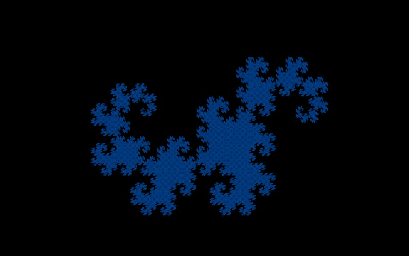

# Dragon Curve

[](../gallery/dragon-curve.jpg)

Fold a strip of paper in half over and over, then open it out to right angles. That is the whole construction.

## The rule

In the complex plane the whole curve is two maps:

$$f_1(z) = \frac{1+i}{2}\,z, \qquad f_2(z) = 1 - \frac{1-i}{2}\,z$$

Both multiply by a complex number of modulus $\left|\tfrac{1\pm i}{2}\right| = \tfrac{1}{\sqrt2}$ and
argument $\pm 45°$: shrink by $1/\sqrt2$, turn by an eighth of a turn. The dragon is the set left
unchanged by applying both and taking the union. Equivalently, and how this program does it, replace
each segment with two meeting at a right angle, alternating which side the corner goes.

### Why folding paper gives the same thing

Fold a strip in half, then in half again the same way, $n$ times, then open every crease to a right
angle. Number the creases $1,\dots,2^n-1$ from one end; crease $k$ is a left turn or a right turn, and
the rule is short: write $k = m\cdot 2^j$ with $m$ odd, and the turn is **left** when
$m \equiv 1 \pmod 4$, right when $m \equiv 3$. Only the odd part of the index matters, which is
the same statement
as *this curve contains a half-size copy of itself*: doubling every index maps the sequence into itself.

### Dimension two, and a fractal boundary

Two copies at ratio $1/\sqrt2$ gives

$$D = \frac{\log 2}{\log \sqrt2} = 2$$

The dragon fills area. Four of them, rotated about a common point, tile the plane exactly, and copies
of it tile the plane on their own — so it has positive area and dimension 2, while never crossing
itself. What is genuinely fractal is its *boundary*, whose dimension is
$\log\lambda/\log\sqrt2 \approx 1.5236$, with $\lambda$ the real root of $\lambda^3 = \lambda^2 + 2$.

### The segments shrink slowly, which the code has to care about

$1/\sqrt2 \approx 0.707$ per level, against $1/3$ for [Koch](koch-snowflake.md). Reaching pieces small
enough for a view a million times in therefore takes $\log(10^{-6})/\log(0.707) \approx 40$ levels
where Koch needs 13, and reaching the deepest view the arithmetic supports takes upwards of 160. That is
why the recursion cap in this program is 400 rather than something tidier.

## Where it came from

Three NASA physicists — **John Heighway**, **Bruce Banks** and **William Harter** — investigated it in 1966; Heighway found it and Harter named it. **Martin Gardner** put it in his Mathematical Games column in *Scientific American* in 1967, which is how most people met it.

## Worth knowing

It is the fractal in **Jurassic Park**. Michael Crichton used successive iterations as the chapter headings, as the book's structure progressively unravels. Donald Knuth records that Harter pointed out to him that the dragons printed in the novel are upside down — "dead dragons".

The paper-folding description is not an analogy. If you actually fold a strip and unfold it, the sequence of left and right creases you get is exactly the sequence this rule generates, which is why it is sometimes called the paperfolding sequence.

## How this program draws it

The frontier of segments at each level comes out in the curve's own order, so a whole level goes into one Skia path as a single polyline instead of a move-and-line per segment — half the points, and the stroke joins at the corners. Its segments shrink by only 1/√2 a level, so reaching the deepest view the arithmetic supports takes upwards of 160 of them, which is why the recursion cap is 400 rather than something tidier. See [DrawnFractals.cs](../../DrawnFractals.cs).

## See it

```bash
dotnet run -c Release -- --explore --no-menu --fractal dragon
```

[← All twenty-six](../../README.md#every-fractal)
