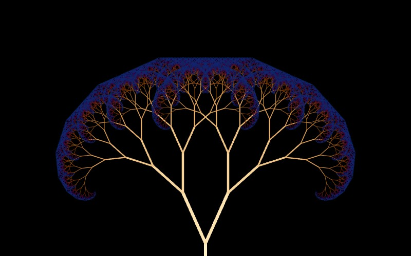

# Fractal Tree

[](../gallery/fractal-tree.jpg)

A trunk, then two smaller copies of the whole tree at an angle to it. The simplest branching rule there is.

## The rule

Draw a segment; from its tip, draw two more at ±0.42 radians, each 0.72 times the length; repeat. Two numbers — the angle and the shrink — decide everything about the shape. Push the shrink above about 0.75 and the branches begin to overlap and the canopy fills in; drop the angle and it becomes a feather.

## Where it came from

Binary branching is old as a picture and hard to attribute, but its formal home is the **L-system**, introduced by the Hungarian biologist **Aristid Lindenmayer** in 1968 to model how algae and plants grow by rewriting strings of symbols. Lindenmayer and Przemysław Prusinkiewicz's *The Algorithmic Beauty of Plants* (1990) is where this kind of rule became a discipline rather than a doodle.

## Worth knowing

The reason it looks like a tree is not that it was designed to. Branching that fills space efficiently has to divide at roughly these ratios, so a rule chosen for simplicity and a tree shaped by selection arrive at the same picture — which was Lindenmayer's point.

## How this program draws it

The tree is the reason this file walks its rules a level at a time rather than depth first. A branch's descendants sprawl about two and a half of its own lengths past its tip, so while the branches are longer than the window nothing can be culled and the count doubles every level; with a single shared budget spent depth first, the first subtree got everything and its siblings got nothing — the tree drew its right-hand side in full detail and left the left side empty.

It is also where the batching came from. Drawing each branch as it was found meant sixteen thousand `DrawLine` calls a frame, each preceded by a colour and width change so Skia could batch none of them: **11.3 fps** at the opening view, before any zooming. Collecting segments into one path per depth took it to **99.6 fps**. See [DrawnFractals.cs](../../DrawnFractals.cs).

## See it

```bash
dotnet run -c Release -- --explore --no-menu --fractal fractal
```

[← All twenty-six](../../README.md#every-fractal)
