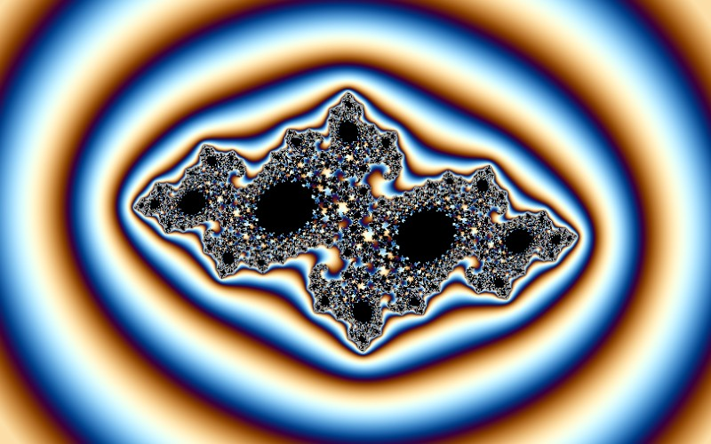

# Julia

[](../gallery/julia.jpg)

The same iteration as the Mandelbrot with the roles swapped: the constant is fixed and the *starting point* is the pixel.

## The rule

Iterate the same map as the Mandelbrot set,

$$z_{n+1} = z_n^2 + k$$

but hold $k$ fixed and let the *starting point* be the pixel. The **filled Julia set** $K_k$ is the set
of starting points whose orbits stay bounded; the Julia set proper is its boundary. This program uses
$k = -0.7269 + 0.1889i$.

### The dichotomy, and what the Mandelbrot set is a map of

Every Julia set is one of exactly two things, and which one is decided by a single orbit — that of the
**critical point** $z=0$, where the derivative $2z$ vanishes:

- if the orbit of $0$ stays bounded, $K_k$ is **connected**;
- if it escapes, $K_k$ is a **Cantor dust** — totally disconnected, uncountably many points, no two of
  them joined.

Nothing in between. And the set of $k$ for which the orbit of $0$ stays bounded *is the Mandelbrot set*.
So the Mandelbrot set is not a fractal that happens to resemble Julia sets; it is the index of them, one
pixel per Julia set, saying which are whole and which are dust. Choosing $k$ just outside the boundary,
as here, gives a set on the edge of falling apart — connected but strung out into filaments, which is
where the spirals come from.

### Why the picture is the same everywhere

The Julia set is where the iteration is **chaotic**: sensitive dependence, and repelling periodic points
dense in it. That last property forces the self-similarity you see. Take any small piece of the Julia
set; because repelling points are dense, some iterate of the map expands that piece over the *whole*
set. Magnifying a detail and iterating are the same operation, so no part of a Julia set is simpler than
the whole. The Mandelbrot set is not like this — its small copies are approximate and its features vary
from place to place — which is exactly why one is an index and the other is an object.

### What this changes for the arithmetic

For the Mandelbrot the pixel enters as $c$, added at *every* step. Here it enters once, as $z_0$, and
never again. Perturbation theory follows that difference: writing $z = Z + \delta$ for a reference orbit
$Z$,

$$\delta_{n+1} = 2Z_n\delta_n + \delta_n^2 \quad\text{(Julia)}, \qquad
\delta_{n+1} = 2Z_n\delta_n + \delta_n^2 + \delta_c \quad\text{(Mandelbrot)}$$

The missing $\delta_c$ is why the bilinear approximation table does not apply here — with no constant
term there is nothing for its $B$ coefficient to multiply — so every iteration is taken individually and
depth costs speed.

## Where it came from

Gaston Julia wrote the 199-page *Mémoire sur l'itération des fonctions rationnelles* in 1918, at twenty-five, in hospital. He had been shot in the face on the Western Front in 1915 and lost his nose; he refused evacuation until the attack had been driven back, and after many failed operations wore a leather strap over the wound for the rest of his life. The memoir won the Académie des sciences' Grand Prix des Sciences Mathématiques that year. Pierre Fatou reached much of the same ground independently and at the same time.

## Worth knowing

The work was essentially forgotten for fifty years. There was nothing to see it with: these are sets defined by what an orbit does forever, and before computer graphics the only way to know one was to reason about it. Mandelbrot, who had been Julia's student at the École Polytechnique, was the one who eventually pointed a computer at it.

## How this program draws it

Perturbed like the Mandelbrot, but the reference orbit is a different object — the orbit of the *anchor point itself* under the fixed constant, rather than the orbit of zero under the anchor — and the per-pixel offset is added once at the start instead of every iteration. Verified sharp at **1e20×**.

That difference caused the one really subtle bug in this repository. Rebasing a perturbed orbit assumes the reference starts at zero, which is true for a Mandelbrot and false here; the missing `Z[0]` term put every rebased pixel out by one anchor and the picture came out as faceted terraces with speckle across them. Fixed in [ReferenceOrbit.cs](../../ReferenceOrbit.cs). Depth costs speed here: with no `dc` term there is nothing for the approximation table to multiply, so every iteration is taken individually.

## See it

```bash
dotnet run -c Release -- --explore --no-menu --fractal julia
```

[← All twenty-six](../../README.md#every-fractal)
