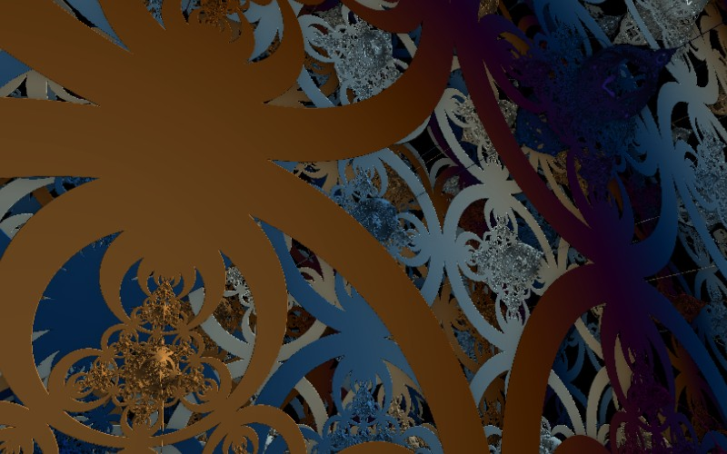

# Kleinian

[](../gallery/kleinian.jpg)

The limit set of a group of Möbius transformations: not an iterated point, but the set that a whole group of symmetries piles up on.

## The rule

### Möbius transformations

A **Möbius transformation** is

$$f(z) = \frac{az+b}{cz+d}, \qquad ad - bc \ne 0$$

They send circles and lines to circles and lines, preserve angles, and compose by multiplying the
matrices $\begin{pmatrix} a & b \\ c & d\end{pmatrix}$ — so a group of them is a group of $2\times2$
matrices, and the whole subject is really linear algebra wearing a disguise.

### Limit sets

Take a small collection of such maps and their inverses, and form every word you can spell in them: that
is a **Kleinian group** $\Gamma$ (a discrete group of Möbius transformations). Apply all of $\Gamma$ to a
single starting point and you get an infinite orbit. Most of it flies off, but it accumulates somewhere,
and the set of accumulation points is the **limit set** $\Lambda(\Gamma)$.

That set is the fractal. It is closed, it is invariant under every element of the group, and — unless the
group is trivially simple — it is either a circle or nowhere-smooth, with no possibilities in between.
Its self-similarity is not a construction rule imposed on it; it is a consequence of being invariant
under infinitely many maps at once. Magnifying part of the limit set *is* applying a group element, so
every part carries the structure of the whole, for the same reason a [Julia set](julia.md) does.

The complement of the limit set is where the group acts nicely — the **domain of discontinuity** — and
the tension between the two is the whole subject. This program renders a *pseudo-Kleinian* distance
estimator: a folding approximation to a three-dimensional limit set, rather than an exact Möbius group,
because ray-marching wants a distance bound and a group orbit does not naturally provide one.

### The loop back to the beginning

Kleinian groups are where the [Mandelbrot set](mandelbrot.md) came from. Robert Brooks and J. Peter
Matelski were studying exactly these — asking when a group generated by two Möbius transformations is
discrete — when they plotted, as an aside, the first picture anyone had made of the Mandelbrot set. The
two ends of this gallery are the same 1978 paper.

### How any of these get drawn: distance estimation

None of these six is tested point by point. Instead each supplies a **distance estimator** — a function
$DE(\mathbf{p})$ that never overestimates how far $\mathbf{p}$ is from the surface. Given one, a ray is
followed by repeatedly stepping exactly that far:

$$\mathbf{p} \leftarrow \mathbf{p} + DE(\mathbf{p})\cdot \mathbf{d}$$

Because the estimate is a lower bound on the true distance, a step can never jump through the object, and
because it is as large as is safe, empty space is crossed in a handful of steps rather than a thousand
small ones. When $DE$ falls below a threshold, the ray has arrived. This is **sphere tracing**, and John
Hart's 1989 "unbounding volumes" for [quaternion Julia sets](quaternion-julia.md) is where it comes from.

For an escape-time set the estimator is the **Koebe / Douady–Hubbard** distance formula, which needs the
derivative of the iteration carried alongside the point:

$$DE = \frac{|z|\,\ln|z|}{|z'|}, \qquad z'_{n+1} = 2 z_n z'_n \ \text{(for a squaring map)}$$

The surface has no analytic normal either, so the shading comes from the numerical gradient of the same
estimate — sample $DE$ a hair either side along each axis and difference it:

$$\mathbf{n} \approx \text{normalise}\bigl(\nabla DE(\mathbf{p})\bigr)$$

which is why these look lit at all. See the march shader in [GpuKernel.cs](../../GpuKernel.cs).

### The controls are a camera

The flat fractals' pan and zoom are re-read here: the pan offsets become yaw and pitch of an orbit about
the origin, and the zoom becomes camera distance. That is why `--center 0,0` is a *bad* view rather than
a neutral one for these six, and why every gallery shot on this page names an angle.

## Where it came from

**Felix Klein** glimpsed these in the 1880s, and had almost no way to see them; the hand-drawn figures in the literature of the period are a handful of circles standing in for something infinite. The modern account is **David Mumford, Caroline Series and David Wright's** *Indra's Pearls: The Vision of Felix Klein* (2002) — named for Indra's net from the Flower Garland Sutra, an infinite array of pearls each reflecting all the others — which is unusual among mathematics books in giving you the algorithms to draw the pictures yourself.

## Worth knowing

Kleinian groups are where the [Mandelbrot set](mandelbrot.md) came from. Robert Brooks and J. Peter Matelski were studying them in 1978 when they plotted, as an aside, the first picture anyone had made of the Mandelbrot set. The two ends of this gallery are the same paper.

## How this program draws it

Ray-marched on the card with a **distance estimator**: rather than testing points for membership, the shader asks "how far can I safely step without hitting anything?" and takes that step, over and over, until the distance falls under a threshold. The surface normal — and so the shading — comes from the gradient of the same estimate. See the march shader in [GpuKernel.cs](../../GpuKernel.cs).

These six read the flat controls as a camera: the pan offsets become yaw and pitch, and the zoom becomes camera distance, so dragging and scrolling orbit the object. They need the card — there is no CPU counterpart — and they are the one group in this program where `--center 0,0` is a bad view rather than a neutral one.

It is also the fractal that made the case for that last sentence. At the default angle of `0,0` this renders **very nearly black**, which is what the first pass of this gallery shipped; with the camera anywhere sensible it is one of the better pictures in the set.

## See it

```bash
dotnet run -c Release -- --explore --no-menu --fractal kleinian --center 0.6,0.4 --zoom 1
```

[← All twenty-six](../../README.md#every-fractal)
