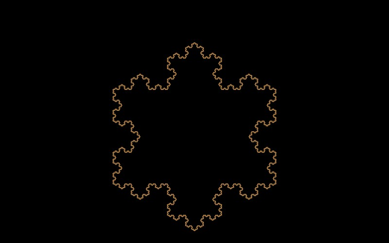

# Koch Snowflake

[](../gallery/koch-snowflake.jpg)

Replace the middle third of every line with two sides of a triangle, and keep going. Infinite perimeter, finite area.

## The rule

Start with an equilateral triangle. Divide each edge into three, and replace the middle third with the other two sides of an equilateral triangle standing on it. Each step multiplies the number of segments by four and divides their length by three, so the perimeter grows by 4/3 every time and without limit — while the whole figure stays inside a circle you could draw around the original triangle. Its dimension is log 4 / log 3 ≈ 1.262.

## Where it came from

Helge von Koch presented it to the Royal Swedish Academy of Sciences on 1 March 1904, under the title *Sur une courbe continue sans tangente, obtenue par une construction géométrique élémentaire* — "on a continuous curve without tangents, obtained by an elementary geometric construction".

## Worth knowing

The title is the whole point, and it is an argument with someone. Karl Weierstrass had shown in 1872 that a function could be continuous everywhere and differentiable nowhere, which was scandalous, but his example was an infinite trigonometric series. Von Koch said plainly that this was **not satisfactory from the geometrical point of view**, because the analytic expression hides the geometric nature of the curve. So he built one you could draw. A century later that instinct — that a picture of the object is worth more than a formula for it — is the whole of fractal geometry.

## How this program draws it

Subdivided level by level rather than depth first, and stopped where a segment falls under two pixels, so what you see is always the finest version that fits the window. Coordinates are [Dd](../../Dd.cs) rather than doubles, which is what lets it keep subdividing past ~1e13×: each level adds an offset a third the size of the last, and once that offset falls below the last bit of the coordinate a double simply loses it and every piece lands in the same place. Verified at **1e22×**, depth 51. See [DrawnFractals.cs](../../DrawnFractals.cs).

## See it

```bash
dotnet run -c Release -- --explore --no-menu --fractal koch
```

[← All twenty-six](../../README.md#every-fractal)
