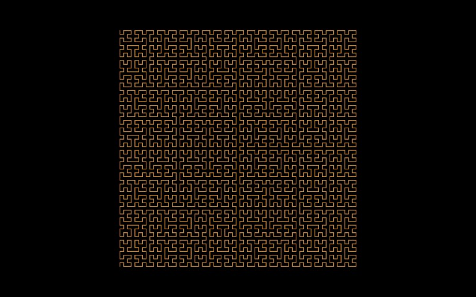

# L-System (Hilbert Curve)

[](../gallery/l-system-hilbert.jpg)

A single line that visits every point of a square, without crossing itself.

## The rule

Divide the unit square into four quadrants and number them in an order where each shares an edge with
the next. Divide each quadrant the same way, rotating and reflecting so the exit of one lands beside the
entry of the next, and repeat. At level $n$ there are $4^n$ cells of side $2^{-n}$, visited in a single
unbroken order.

As maps it is four affine transformations of ratio $\tfrac12$, two of them plain translations and two
including a reflection:

$$h_0 = \tfrac12 M_{\text{diag}}, \qquad h_1 = \tfrac12 I, \qquad h_2 = \tfrac12 I, \qquad
h_3 = \tfrac12 M_{\text{anti}}$$

where $M_{\text{diag}}$ swaps the coordinates and $M_{\text{anti}}$ swaps and negates them. Those two
reflections are the whole trick: without them the cells would be visited in an order that jumps across
the square, and the curve would not be continuous.

### It fills the square, and cannot be one-to-one

The limit is a map $h : [0,1] \to [0,1]^2$ that is continuous and **onto**: every point of the square is
$h(t)$ for some $t$. It cannot also be one-to-one. A continuous bijection from a compact space to a
Hausdorff one is a homeomorphism, and the interval is not homeomorphic to the square — remove an
interior point from the interval and it falls apart, remove one from the square and it does not. So a
space-filling curve must revisit points, and this one does, at the cell corners.

### Why it is the one used for indexing

The curve is **Hölder continuous with exponent $\tfrac12$**:

$$\|h(s) - h(t)\| \le C\,|s-t|^{1/2}$$

and $\tfrac12$ is the best possible for any map from an interval onto a square. That is the locality
guarantee: points a distance $\varepsilon$ apart along the curve are at most $C\sqrt{\varepsilon}$ apart
in the plane, always. Cutting the curve into equal pieces therefore cuts the square into compact
regions, which is why the Hilbert order is used to linearise two-dimensional data for database indexes,
caches and image dithering — a one-dimensional address that remembers two-dimensional neighbourhood.

The converse is weaker, and has to be: points can be close in the square and far apart along the curve,
since the curve has to arrive and leave somehow. No ordering of the plane avoids that.

## Where it came from

**David Hilbert** published it in 1891, a year after **Giuseppe Peano** produced the first space-filling curve. Peano proved it could be done; Hilbert gave the version with a picture and a clear geometric recursion, which is why this is the one everybody draws.

## Worth knowing

It is genuinely useful, which is unusual in this list. The Hilbert curve preserves locality — points close on the curve are close in the square — so it is used to linearise multi-dimensional data for database indexes and caches, and to order pixels for dithering. A one-dimensional address that remembers two-dimensional neighbourhood is worth a great deal.

## How this program draws it

Unlike every other rule here this one has to be walked **in order**, because it is a single curve and the order of the leaves *is* the curve — so it stays a depth-first recursion, with culled subtrees breaking the path rather than being drawn across.

Its depth is chosen from the visible cell count as well as the cell size. From size alone, a window wider than the curve's square asks for more cells than can be drawn, and running out partway through an ordered walk leaves a contiguous first stretch drawn and the rest missing — which reads as a solid block with a bite out of it, not as a curve. See [DrawnFractals.cs](../../DrawnFractals.cs).

## See it

```bash
dotnet run -c Release -- --explore --no-menu --fractal l-system
```

[← All twenty-six](../../README.md#every-fractal)
