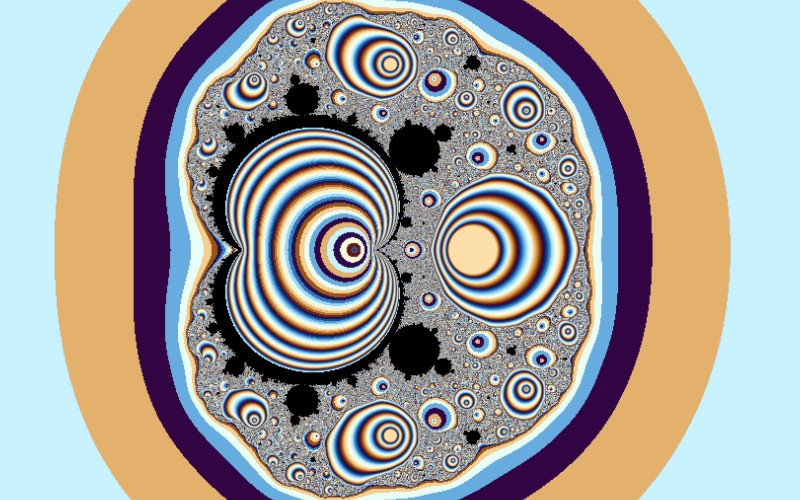

# Magnet

[](../gallery/magnet.jpg)

A formula that came out of statistical physics rather than mathematics: the boundary between a magnet and a non-magnet.

## The rule

$$z_{n+1} = \left(\frac{z_n^2 + c - 1}{2z_n + c - 2}\right)^{\!2}$$

started from $z_0 = 0$. A rational map, not a polynomial, and it comes from physics rather than from
iteration theory.

### What it is a transformation of

This is a **renormalisation** step for the Ising model of a magnet. The Ising model is a lattice of spins
that prefer to align with their neighbours, and the question is whether that local preference produces
order across the whole material. Renormalisation answers it by coarse-graining: group the spins into
blocks, work out what effective interaction between *blocks* reproduces the same physics, and repeat.
Each pass replaces the temperature-like parameter $z$ with a new one, and this rational map is that
replacement.

Iterating it is therefore looking at the same material at coarser and coarser scales. The fixed points
are the phases:

- orbits running off to infinity — disorder wins at large scales, the material is not magnetic;
- orbits converging to $z = 1$ — order wins, it is magnetic.

The **critical point** is the boundary between the two, the temperature at which the material changes
phase, and that boundary is the fractal on screen. Its infinite detail is a statement about critical
phenomena: at the transition the material has structure on every scale at once, which is what makes
critical exponents universal across wildly different physical systems.

### Two endings to test for

Because it can both escape and converge, the kernel checks both every iteration: a bailout radius for
divergence, and a threshold on $|z_{n+1} - z_n|$ for settling. It also has to guard the denominator —
$2z + c - 2$ genuinely reaches zero — where the point is treated as interior. Convergence is counted in
whole iterations, so like [Newton](newton.md) its deep views are flatter than an escape-time set's.

## Where it came from

The formula is a renormalisation transformation for the Ising model of a ferromagnet: iterate it and you are following what happens to the effective temperature of a magnetic material as you look at it on coarser and coarser scales. Its fixed points are the phases, and the boundary between them — the fractal — is the critical point where the material changes from magnetic to not. It is set out in Peitgen and Richter's *The Beauty of Fractals* (1986), p. 129, and reached fractal software through Fractint, contributed by Scott Taylor and Lee Skinner.

## Worth knowing

This one is a genuine physical object rather than a picture that resembles one. The shape on screen is the phase boundary of a model that physicists were solving for reasons entirely unconnected with fractal geometry, and the fact that it is infinitely detailed is a statement about critical phenomena, not about drawing.

## How this program draws it

Both endings are tested every iteration: a bailout radius for escape, and a settling threshold on the step size for convergence. The division needs a guard — the denominator `2z + c − 2` genuinely reaches zero — and where it does the point is treated as interior.

Like [Newton](newton.md), it colours by a whole iteration count where it converges, so its deep views are flatter than an escape-time set's.

## See it

```bash
dotnet run -c Release -- --explore --no-menu --fractal magnet
```

[← All twenty-six](../../README.md#every-fractal)
