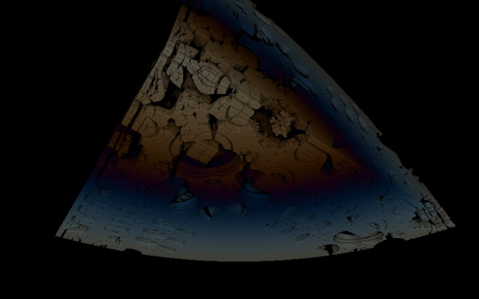

# Mandelbox

[](../gallery/mandelbox.jpg)

Not a formula that escapes — a space that folds. Two folds and a scale, repeated, and the result looks built rather than grown.

## The rule

Each iteration does three things: a **box fold**, which reflects any coordinate beyond a limit back inside; a **sphere fold**, which inverts points that are too close to the origin outward; and then a scale and an offset. Nothing is squared and nothing rotates. The straight edges, corridors and right angles come directly from the fact that the only operations are reflections and inversions.

## Where it came from

**Tom Lowe** — "Tglad" — introduced it on Fractal Forums in early 2010, from experiments with whether iterated folding could produce bounded self-similar structure the way the Mandelbrot iteration does in two dimensions. It could, and the results looked like nothing else in the field.

## Worth knowing

It is the fractal that looks man-made. Every other object here is knobbly, branched or encrusted; the Mandelbox has hallways, balconies and machined-looking panels, and it got adopted almost immediately by animators for exactly that reason. The scale parameter changes it drastically — negative values give a completely different object — so "the" Mandelbox is really a family.

## How this program draws it

Ray-marched on the card with a **distance estimator**: rather than testing points for membership, the shader asks "how far can I safely step without hitting anything?" and takes that step, over and over, until the distance falls under a threshold. The surface normal — and so the shading — comes from the gradient of the same estimate. See the march shader in [GpuKernel.cs](../../GpuKernel.cs).

These six read the flat controls as a camera: the pan offsets become yaw and pitch, and the zoom becomes camera distance, so dragging and scrolling orbit the object. They need the card — there is no CPU counterpart — and they are the one group in this program where `--center 0,0` is a bad view rather than a neutral one.

The gallery view uses `--zoom 0.5`, which pulls the camera *back* rather than in. Values below 1 were rejected by the flag until this gallery needed one.

## See it

```bash
dotnet run -c Release -- --explore --no-menu --fractal mandelbox --center 2.2,0.8 --zoom 0.5
```

[← All twenty-six](../../README.md#every-fractal)
