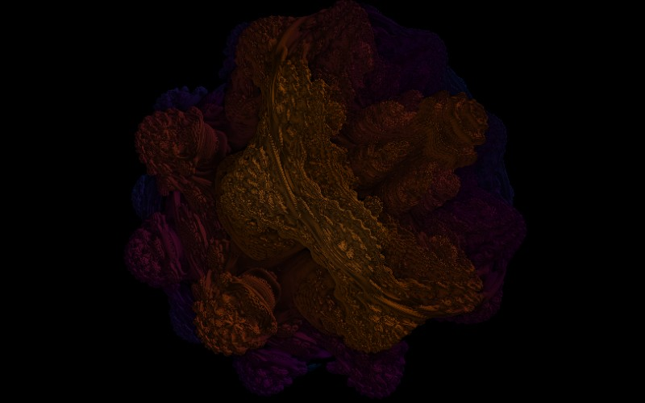

# Mandelbulb

[](../gallery/mandelbulb.jpg)

The answer to an obvious question that took thirty years to answer: what does the Mandelbrot set look like in three dimensions?

## The rule

Squaring a complex number doubles its angle and squares its length. Generalise that to three dimensions in spherical coordinates — multiply both the polar and azimuthal angles by `n`, raise the radius to the `n`, add the offset — and iterate. At `n = 8` the result has the bulbs, the seams and the encrusted detail people had been looking for.

## Where it came from

Found in 2009 by **Daniel White** and **Paul Nylander**, working in public on Fractal Forums. White posted the spherical "triplex" formulation with renders at powers 2 through 8; Nylander followed almost immediately with the power-8 image that became the canonical Mandelbulb. Neither patented nor trademarked anything, and both shared the credit openly.

## Worth knowing

The wait was not for computers — it was for the right multiplication. Quaternions were tried for decades (see [Quaternion Julia](quaternion-julia.md)) and give something too smooth; the honest three-dimensional analogue of the complex numbers does not exist, so the Mandelbulb is not a number system at all but an operation chosen to *behave* like squaring. The power of 8 has no theoretical justification whatsoever. It was picked because it looked best.

## How this program draws it

Ray-marched on the card with a **distance estimator**: rather than testing points for membership, the shader asks "how far can I safely step without hitting anything?" and takes that step, over and over, until the distance falls under a threshold. The surface normal — and so the shading — comes from the gradient of the same estimate. See the march shader in [GpuKernel.cs](../../GpuKernel.cs).

These six read the flat controls as a camera: the pan offsets become yaw and pitch, and the zoom becomes camera distance, so dragging and scrolling orbit the object. They need the card — there is no CPU counterpart — and they are the one group in this program where `--center 0,0` is a bad view rather than a neutral one.

## See it

```bash
dotnet run -c Release -- --explore --no-menu --fractal mandelbulb --center 0.6,0.4 --zoom 1.6
```

[← All twenty-six](../../README.md#every-fractal)
