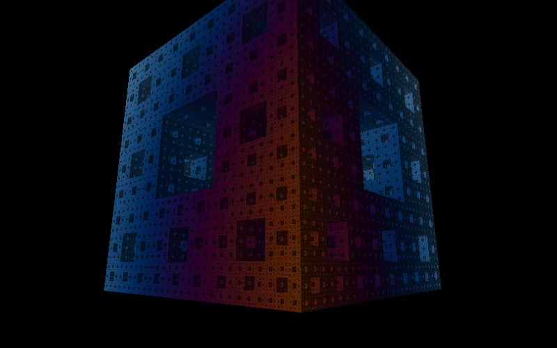

# Menger Sponge

[](../gallery/menger-sponge.jpg)

A cube with the middle of every face and its core removed, twenty of the twenty-seven sub-cubes kept, forever.

## The rule

Divide a cube into 27. Remove the six face-centres and the one in the middle, keeping 20. Repeat on each. The volume goes to zero and the surface area grows without bound. Its dimension is log 20 / log 3 ≈ 2.727 — more than a surface, less than a solid.

## Where it came from

**Karl Menger** described it in 1926, while working on what "dimension" ought to mean for sets that are not manifolds. Any face of it is a [Sierpiński carpet](sierpinski-carpet.md).

## Worth knowing

It is a **universal curve**: every one-dimensional compact set, of any topology, in any number of dimensions, embeds in it. Every knot, every graph, every tangle you can imagine is somewhere in this one sponge.

In October 2014 the **MegaMenger** project, run by Matt Parker and Laura Taalman, built a level-four sponge distributed across more than twenty sites worldwide, out of folded business cards — six cards per small cube, and on the order of a million cards in total.

## How this program draws it

Ray-marched on the card with a **distance estimator**: rather than testing points for membership, the shader asks "how far can I safely step without hitting anything?" and takes that step, over and over, until the distance falls under a threshold. The surface normal — and so the shading — comes from the gradient of the same estimate. See the march shader in [GpuKernel.cs](../../GpuKernel.cs).

These six read the flat controls as a camera: the pan offsets become yaw and pitch, and the zoom becomes camera distance, so dragging and scrolling orbit the object. They need the card — there is no CPU counterpart — and they are the one group in this program where `--center 0,0` is a bad view rather than a neutral one.

## See it

```bash
dotnet run -c Release -- --explore --no-menu --fractal menger --center 4.0,0.25 --zoom 2.6
```

[← All twenty-six](../../README.md#every-fractal)
