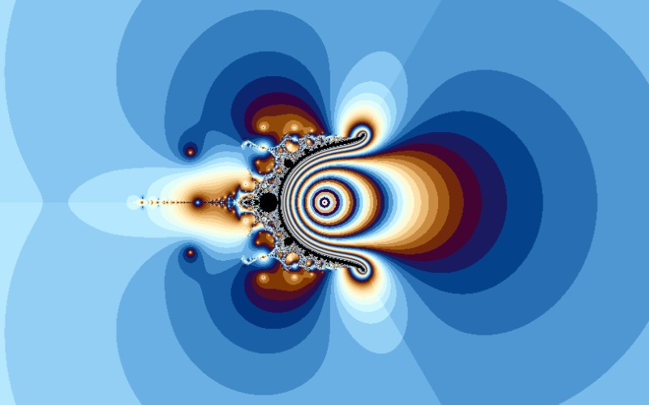

# Nova

[](../gallery/nova.jpg)

Newton's method with the pixel added back in every step, which turns a root-finder into a Mandelbrot-like parameter map.

## The rule

Take the Newton step for $z^3 - 1$ and add a constant read from the pixel:

$$z_{n+1} = z_n - \frac{z_n^3 - 1}{3z_n^2} + c$$

started from a fixed point rather than from the pixel. That single addition changes the *kind* of
picture: where [Newton](newton.md) is a map of starting points for one equation, this is a map of
**parameters** — one pixel per perturbed root-finder, asking whether that root-finder still works.

### Why the added term breaks convergence

Without $c$ the roots are superattracting and every basin is open. With it, the fixed points move: a
fixed point now satisfies $z = z - f(z)/f'(z) + c$, that is $f(z)/f'(z) = c$, and the multiplier there
is no longer zero. Small $c$ shifts the roots slightly and convergence survives, quadratic convergence
degrading to linear. Large enough $c$ and the fixed point loses stability altogether, the iteration
stops settling, and the parameter is outside the set.

That is the same structure as the Mandelbrot set — a parameter plane divided into where an iteration
settles and where it does not — which is why the Nova grows Mandelbrot-like buds around a rather
different body, and why the same colouring works on it.

## Where it came from

**Paul Derbyshire** introduced it in the mid-1990s, as a modification of Newton's method intended to change its rate of convergence. It spread through the fractal software of that era rather than through journals — which is true of a fair number of the formulas in this program, and is why the attributions for them are harder to pin down than for the ones with a paper behind them.

## Worth knowing

It is a good illustration of how thin the line is between "numerical method" and "fractal". Nothing about a relaxed Newton iteration is meant to be decorative; the pictures are a side effect of asking where a root-finder fails, and the shapes that appear are the shapes of failure.

## How this program draws it

Shares its code with the [Newton](newton.md) fractal — the same routine with a non-zero `add` term, started from `z = 1` instead of from the pixel. See `Newton(...)` in [Mandelbrot.cs](../../Mandelbrot.cs).

## See it

```bash
dotnet run -c Release -- --explore --no-menu --fractal nova
```

[← All twenty-six](../../README.md#every-fractal)
