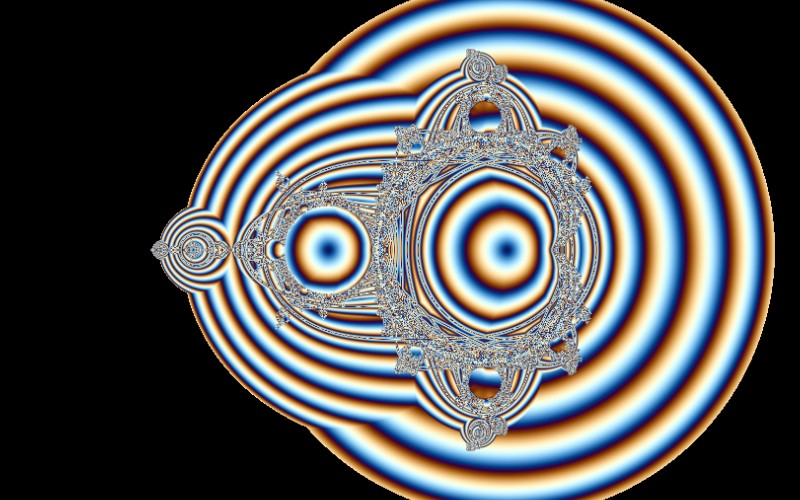

# Orbit Trap

[](../gallery/orbit-trap.jpg)

The Mandelbrot iteration, coloured by how near the orbit ever came to a circle.

## The rule

The same dynamics as the Mandelbrot set, but instead of recording when the orbit escaped, record its closest approach to a circle of radius ½ about the origin. Points whose orbits pass close to that circle are bright. The set's familiar outline is still there underneath, but the interior — which escape-time colouring renders as a flat black region — fills with structure, because the orbits in there are still doing something even though they never leave.

## Where it came from

The technique generalises **Clifford Pickover's** epsilon-cross work of the 1980s (see [Pickover Stalks](pickover-stalks.md)). Once the trap can be any shape, this becomes less a fractal than a rendering method: the same iteration with a different question asked of it.

## Worth knowing

It is the clearest demonstration in this program that the *picture* of a fractal is a choice rather than a fact. The Mandelbrot set, its Pickover stalks and this are the same orbits and the same plane, coloured by three different measurements, and they look nothing alike.

## How this program draws it

Shares its implementation with [Pickover Stalks](pickover-stalks.md) — one routine, a flag choosing between the axes and the circle, and a different starting point. See `Trap(...)` in [Mandelbrot.cs](../../Mandelbrot.cs).

## See it

```bash
dotnet run -c Release -- --explore --no-menu --fractal orbit
```

[← All twenty-six](../../README.md#every-fractal)
