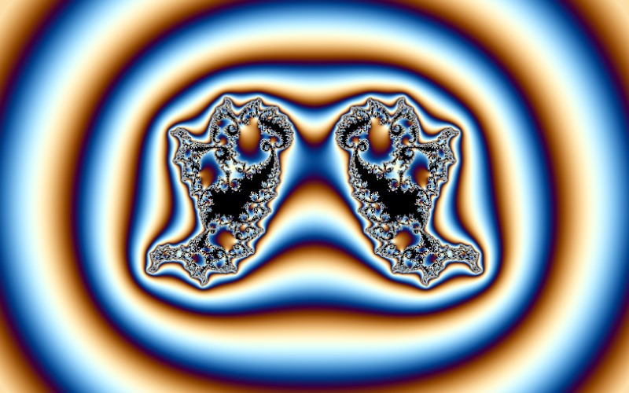

# Phoenix

[](../gallery/phoenix.jpg)

The only formula here that remembers: each step uses the previous value as well as the current one.

## The rule

$$z_{n+1} = z_n^2 + p_1 + p_2\,z_{n-1}$$

started from the pixel, with $p_1 = 0.56667$ and $p_2 = -0.5$ fixed. The last term is the whole point:
the next value depends on the previous *two*, not one.

### A second-order recurrence is a two-dimensional map

Any recurrence that remembers can be rewritten as a first-order one in more variables. Put
$w_n = z_{n-1}$ and the Phoenix becomes

$$\begin{pmatrix} z_{n+1} \\ w_{n+1}\end{pmatrix} =
\begin{pmatrix} z_n^2 + p_1 + p_2 w_n \\ z_n \end{pmatrix}$$

which is a map of $\mathbb{C}^2$ — a **complexified Hénon map**, the standard example of a dynamical
system with a strange attractor. The Phoenix that gets drawn is a two-real-dimensional slice through a
four-real-dimensional object, which is why its shapes are unlike anything the one-dimensional formulas
produce: the curling tendrils are cross-sections of structure that mostly points out of the picture.

### Why $p_2$ is negative, and why the constants must be constants

With $p_2 = 0$ the whole thing collapses to a Julia set. Negative $p_2$ makes each step pull *back*
toward where the orbit was two steps ago, which is a rotation in the $(z,w)$ plane and what produces the
spiralling.

Both parameters have to be genuine constants, and this is where an early version of this program went
wrong. Feeding the pixel in as $p_1$, the way a Mandelbrot feeds it in as $c$, leaves the imaginary part
of the orbit unseeded: starting from a real $z_0$ with real parameters, every subsequent value stays
real, the iteration never leaves the line, and the picture comes out as flat horizontal bands. It has to
be iterated from the pixel with the constants fixed — a Julia-type construction, not a Mandelbrot-type
one.

## Where it came from

Shigehiro Ushiki published it as "Phoenix" in IEEE Transactions on Circuits and Systems 35(7), 788–789, in July 1988, at Kyoto University. The paper presents it as a complex one-dimensional section of a Julia-like set of a **complexified Hénon map** — the memory term is what is left of the second dimension of the Hénon map after the slice.

## Worth knowing

The Hénon map is one of the standard examples of a strange attractor in dynamical systems, so the Phoenix is a fractal that arrived from the chaos-theory side of the subject rather than from complex analysis, and reached the fractal-art world afterwards.

## How this program draws it

Drawn with the axes swapped, which is what stands the flames upright rather than laying them on their side.

It was also the one formula that came out visibly wrong on the first attempt here. Feeding the pixel in as `c`, the way a Mandelbrot does, leaves the imaginary part unseeded: the whole orbit stays on the real axis and the picture is a set of flat horizontal bands. It has to start from the pixel like a Julia set, with both constants fixed. See `Phoenix` in [Mandelbrot.cs](../../Mandelbrot.cs).

## See it

```bash
dotnet run -c Release -- --explore --no-menu --fractal phoenix
```

[← All twenty-six](../../README.md#every-fractal)
