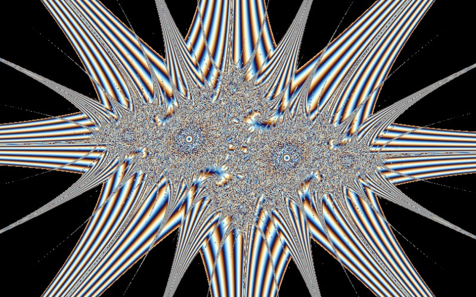

# Pickover Stalks

[](../gallery/pickover-stalks.jpg)

The same iteration as a Julia set, but what is recorded is not when the orbit escaped — it is how close it ever came to the axes.

## The rule

The iteration is an ordinary Julia one,

$$z_{n+1} = z_n^2 + k$$

but what is recorded is not when it escaped. At every step, measure how close the orbit came to the two
axes and keep the smallest value seen:

$$\tau = \min_{n \le N} \min\bigl(|\operatorname{Re} z_n|,\ |\operatorname{Im} z_n|\bigr)$$

Colour by $\tau$. This is an **orbit trap**: a region of the plane that the orbit is watched for, rather
than a test of where the orbit ends up.

### Why it shows what escape time cannot

Escape time is constant on large regions — every point of the interior escapes never, and the exterior
is graded smoothly by the potential. The trap distance is not. Whether an orbit passes near an axis
depends on the whole path, and the path depends on the starting point chaotically, so $\tau$ varies on
arbitrarily fine scales in places where the escape count is flat. In particular the *interior*, which
escape-time colouring renders as a black region with nothing in it, is where orbits wander for ever and
have the most opportunities to graze a trap. The stalks are the level sets of that.

Pickover's original was the **epsilon cross**: count the point if the orbit ever comes within
$\varepsilon$ of either axis. Taking the minimum instead of a yes-or-no test is the same idea made
continuous, so it can be fed into a gradient rather than a binary mask.

### Choices that shape the picture

The trap is applied to a Julia iteration rather than a Mandelbrot one, because a fixed $k$ makes the
orbits linger near the axes rather than escaping quickly. The distance is turned into a palette
coordinate through a logarithm, so an orbit that comes ten times closer moves a fixed distance along the
gradient rather than saturating. And the iteration is capped well below the full budget — the closest
approach nearly always happens early, long before an escape count would be decided.

## Where it came from

**Clifford Pickover** devised the method at IBM's Thomas J. Watson Research Center in the 1980s. His version was the "epsilon cross" — a cross-shaped trap sitting on the axes — and the structures it revealed were named after him. The same work produced his **biomorphs**, which come from a small change to the convergence test and look startlingly like microscope slides of invertebrates.

## Worth knowing

This is the ancestor of every **orbit trap** technique: once you notice that you may colour a pixel by anything the orbit does rather than only by when it left, the trap can be any shape at all — a point, a circle, a line, an image. See [Orbit Trap](orbit-trap.md) for the circle version, which is the same idea with a different target.

## How this program draws it

Traps are cheap and settle early, so the iteration is capped at 400 steps rather than the full budget — the closest approach has almost always happened long before an escape count would. The trap distance is turned into a palette coordinate by a logarithm, so an orbit that comes ten times closer moves a fixed distance along the gradient.

## See it

```bash
dotnet run -c Release -- --explore --no-menu --fractal pickover
```

[← All twenty-six](../../README.md#every-fractal)
