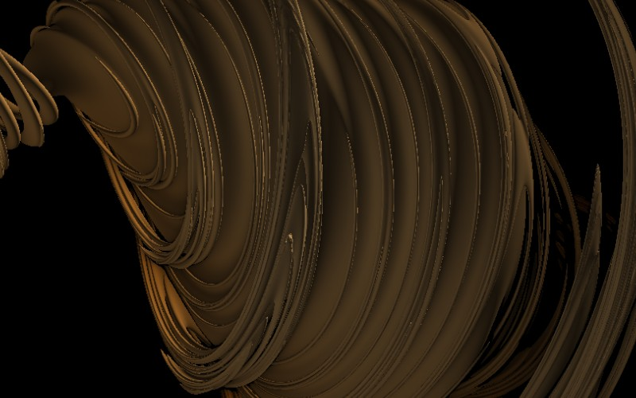

# Quaternion Julia

[](../gallery/quaternion-julia.jpg)

A Julia set built in the quaternions, where numbers have four components — so the set is four-dimensional and what you see is a slice.

## The rule

The same $z \mapsto z^2 + k$ as an ordinary [Julia set](julia.md), with $z$ and $k$ **quaternions**:

$$q = a + b\,\mathbf{i} + c\,\mathbf{j} + d\,\mathbf{k}, \qquad
\mathbf{i}^2 = \mathbf{j}^2 = \mathbf{k}^2 = \mathbf{i}\mathbf{j}\mathbf{k} = -1$$

Four real components, so the set lives in four dimensions and what is rendered is a three-dimensional
slice — usually by fixing the fourth component at a constant.

### Non-commutative, but it does not matter here

Quaternion multiplication is associative but **not commutative**: $\mathbf{ij} = \mathbf{k}$ while
$\mathbf{ji} = -\mathbf{k}$. For squaring that turns out not to bite, since $q$ commutes with itself, and
writing $q = a + \mathbf{v}$ with $\mathbf{v}$ the vector part:

$$q^2 = a^2 - \|\mathbf{v}\|^2 + 2a\mathbf{v}$$

which stays in the plane spanned by $1$ and $\mathbf{v}$. So each individual orbit is confined to a
complex plane through the real axis and behaves exactly like an ordinary complex Julia orbit. The
four-dimensional set is what you get from *all* those planes at once — a family of complex Julia sets
rotated about the real axis.

That is precisely why it looks the way it does. The set has a rotational symmetry the Mandelbulb does
not, its surfaces are swept and shell-like rather than encrusted, and it was the disappointment with
this — too smooth, too obviously a solid of revolution in disguise — that drove the search for a
genuinely three-dimensional analogue and eventually produced the [Mandelbulb](mandelbulb.md).

### How any of these get drawn: distance estimation

None of these six is tested point by point. Instead each supplies a **distance estimator** — a function
$DE(\mathbf{p})$ that never overestimates how far $\mathbf{p}$ is from the surface. Given one, a ray is
followed by repeatedly stepping exactly that far:

$$\mathbf{p} \leftarrow \mathbf{p} + DE(\mathbf{p})\cdot \mathbf{d}$$

Because the estimate is a lower bound on the true distance, a step can never jump through the object, and
because it is as large as is safe, empty space is crossed in a handful of steps rather than a thousand
small ones. When $DE$ falls below a threshold, the ray has arrived. This is **sphere tracing**, and John
Hart's 1989 "unbounding volumes" for [quaternion Julia sets](quaternion-julia.md) is where it comes from.

For an escape-time set the estimator is the **Koebe / Douady–Hubbard** distance formula, which needs the
derivative of the iteration carried alongside the point:

$$DE = \frac{|z|\,\ln|z|}{|z'|}, \qquad z'_{n+1} = 2 z_n z'_n \ \text{(for a squaring map)}$$

The surface has no analytic normal either, so the shading comes from the numerical gradient of the same
estimate — sample $DE$ a hair either side along each axis and difference it:

$$\mathbf{n} \approx \text{normalise}\bigl(\nabla DE(\mathbf{p})\bigr)$$

which is why these look lit at all. See the march shader in [GpuKernel.cs](../../GpuKernel.cs).

### The controls are a camera

The flat fractals' pan and zoom are re-read here: the pan offsets become yaw and pitch of an orbit about
the origin, and the zoom becomes camera distance. That is why `--center 0,0` is a *bad* view rather than
a neutral one for these six, and why every gallery shot on this page names an angle.

## Where it came from

**Alan Norton**, at IBM Research, published quaternion Julia set images in 1982 — among the earliest three-dimensional fractal renderings anyone made. In 1989 **John Hart**, with Dan Sandin and Louis Kauffman, published "Ray tracing deterministic 3-D fractals", which introduced the **unbounding volume**: step along a ray by a distance guaranteed smaller than the distance to the set, and you can never overshoot it.

## Worth knowing

That 1989 paper is the direct ancestor of how every three-dimensional fractal in this program is drawn. Distance-estimated sphere tracing is now standard for real-time shader work far beyond fractals, and it started as a way to ray-trace this object.

## How this program draws it

Ray-marched on the card with a **distance estimator**: rather than testing points for membership, the shader asks "how far can I safely step without hitting anything?" and takes that step, over and over, until the distance falls under a threshold. The surface normal — and so the shading — comes from the gradient of the same estimate. See the march shader in [GpuKernel.cs](../../GpuKernel.cs).

These six read the flat controls as a camera: the pan offsets become yaw and pitch, and the zoom becomes camera distance, so dragging and scrolling orbit the object. They need the card — there is no CPU counterpart — and they are the one group in this program where `--center 0,0` is a bad view rather than a neutral one.

## See it

```bash
dotnet run -c Release -- --explore --no-menu --fractal quaternion --center 0.6,0.4 --zoom 4
```

[← All twenty-six](../../README.md#every-fractal)
