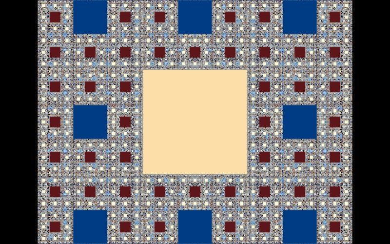

# Sierpiński Carpet

[](../gallery/sierpinski-carpet.jpg)

The same idea in base three: cut the middle ninth out of a square, forever.

## The rule

Multiply the coordinate by three repeatedly, reading one base-3 digit of `x` and `y` each step. When both digits are the middle one, the point is in the ninth that gets removed, and that step number is the colour. Nine copies at one third the size, one of them discarded.

## Where it came from

**Wacław Sierpiński** described it in 1916, a year after the triangle. Karl Menger's [sponge](menger-sponge.md) is its three-dimensional counterpart, and the two are usually introduced together for that reason.

## Worth knowing

The carpet is a **universal plane curve**: every compact one-dimensional subset of the plane, no matter how tangled, can be embedded in it. That is a much stronger statement than it looks. Any curve you can draw — any knot, any web, any set of that dimension whatsoever — is a copy of some part of this one object.

## How this program draws it

A base-3 digit test per pixel, sharing its structure with the [triangle](sierpinski-triangle.md). Each step consumes log₂3 ≈ 1.58 bits rather than one, so it runs out sooner: about 28 levels in a double and about 62 in the wide arithmetic of [Dd.cs](../../Dd.cs).

## See it

```bash
dotnet run -c Release -- --explore --no-menu --fractal "sierpinski c" --zoom 1.6
```

[← All twenty-six](../../README.md#every-fractal)
