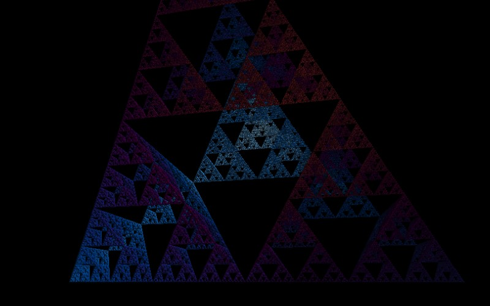

# Sierpiński Tetrahedron

[](../gallery/sierpinski-tetrahedron.jpg)

The [triangle](sierpinski-triangle.md) in three dimensions: four half-size copies at the corners, and the middle left empty.

## The rule

Take a tetrahedron, shrink it by half, and place four copies at its four vertices. Repeat. The result is sometimes called the tetrix.

## Where it came from

The natural three-dimensional analogue of Sierpiński's 1915 construction, and old enough as an object that it is not really attributable to anyone in particular.

## Worth knowing

Its dimension is **exactly 2** — log 4 / log 2 — which makes it the neatest curiosity in this list. It is a fractal with an integer dimension: the same dimension as a flat sheet of paper, occupying three-dimensional space, with zero volume. Look at it along an edge and it really does close up into a solid-looking square, which is the dimension being two showing itself.

## How this program draws it

Ray-marched on the card with a **distance estimator**: rather than testing points for membership, the shader asks "how far can I safely step without hitting anything?" and takes that step, over and over, until the distance falls under a threshold. The surface normal — and so the shading — comes from the gradient of the same estimate. See the march shader in [GpuKernel.cs](../../GpuKernel.cs).

These six read the flat controls as a camera: the pan offsets become yaw and pitch, and the zoom becomes camera distance, so dragging and scrolling orbit the object. They need the card — there is no CPU counterpart — and they are the one group in this program where `--center 0,0` is a bad view rather than a neutral one.

## See it

```bash
dotnet run -c Release -- --explore --no-menu --fractal "sierpinski te" --center 0.6,0.4 --zoom 1.6
```

[← All twenty-six](../../README.md#every-fractal)
