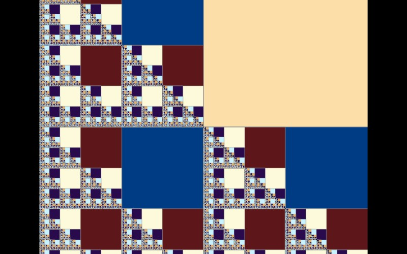

# Sierpiński Triangle

[](../gallery/sierpinski-triangle.jpg)

The classic middle-removed triangle, computed here as a digit test on the coordinate rather than drawn.

## The rule

Take the unit square and repeatedly double the coordinate, reading off one binary digit of each of `x` and `y` per step. Whenever both digits come up "upper right", the point has landed in the quadrant that gets removed, and the step at which that happens is what is coloured. Points that survive many doublings are the ones on the finest structure.

## Where it came from

**Wacław Sierpiński** described it in 1915. It is far older than that as a decoration: essentially the same pattern appears in **13th-century Cosmati mosaics** in the cathedral at Anagni and in church floors across central Italy — roughly seven hundred years before anyone wrote down what it was. The medieval craftsmen who laid those floors were iterating a rule to a depth of three or four because it looked right.

## Worth knowing

The triangle turns up in places that seem to have nothing to do with it: Pascal's triangle with the odd numbers shaded, the Tower of Hanoi's graph of legal positions, and Barnsley's chaos game, where plotting a random walk toward three corners produces it with probability one. It is what self-similar with ratio ½ and three copies *means*, so anything with that structure is it.

## How this program draws it

Testing per pixel rather than drawing has one real advantage: it keeps working as far down as the arithmetic does, where a drawn triangle would need ever more geometry. Each doubling consumes one bit of the coordinate, so a double runs out after about 45 levels and the wide arithmetic in [Dd.cs](../../Dd.cs) after about 100 — which is the deepest budget of any formula in the file.

## See it

```bash
dotnet run -c Release -- --explore --no-menu --fractal "sierpinski t" --zoom 1.6
```

[← All twenty-six](../../README.md#every-fractal)
