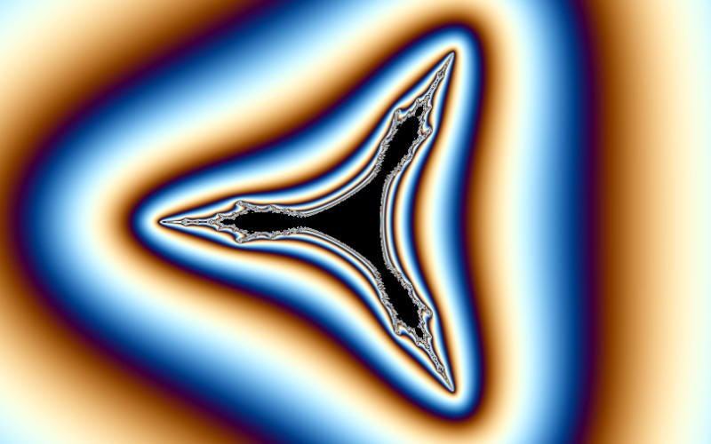

# Tricorn

[](../gallery/tricorn.jpg)

Also called the Mandelbar: conjugate `z` before squaring, and the set grows three corners.

## The rule

`z → conj(z)² + c`. Conjugating reverses the direction of rotation each step, which folds the familiar cardioid into a three-cornered figure with three-fold symmetry. Like the Burning Ship it is non-analytic, and for the same reason: conjugation is not complex-differentiable.

## Where it came from

Introduced as the *Mandelbar set* by Crowe, Hasson, Rippon and Strain-Clark in 1989, in "On the structure of the Mandelbar set" (Nonlinearity 2(4), 541–553). John Milnor later ran into tricorn-like sets from a completely different direction — as a recurring configuration in the parameter space of real cubic polynomials, and in other families of rational maps — which is part of why the shape is taken seriously rather than treated as a curiosity.

## Worth knowing

Its boundary behaves unlike the Mandelbrot's in ways that took years to establish. Where the Mandelbrot set is connected and conjectured to be locally connected, the tricorn and its higher-degree relatives are known **not to be path connected** — a result of Hubbard and Schleicher's. Anti-holomorphic dynamics turned out to be its own subject rather than a footnote to the holomorphic case.

## How this program draws it

One code path serves the Mandelbrot, the Julia and the Tricorn — the same quadratic step with a sign on the imaginary term, which is all conjugation amounts to here. See the `conjugate` parameter in [Mandelbrot.cs](../../Mandelbrot.cs).

The gallery view is pulled *back* from the opening one (`--zoom 0.7`), because at the default width the third corner is off the bottom of the frame.

## See it

```bash
dotnet run -c Release -- --explore --no-menu --fractal tricorn --center 0,0 --zoom 0.7
```

[← All twenty-six](../../README.md#every-fractal)
